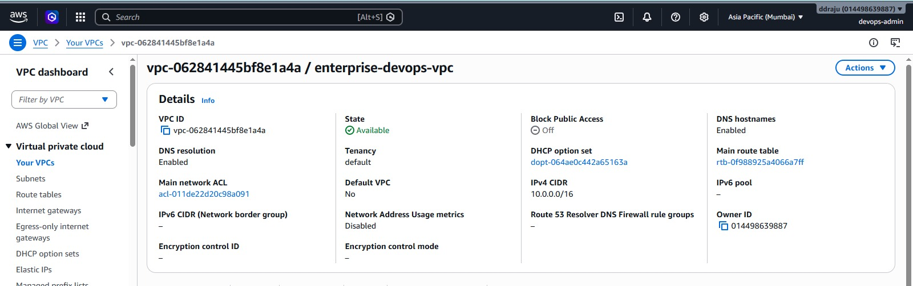
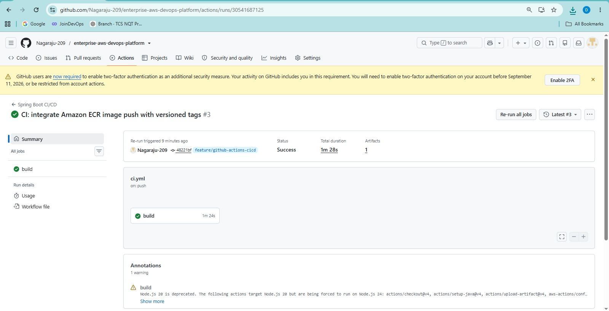
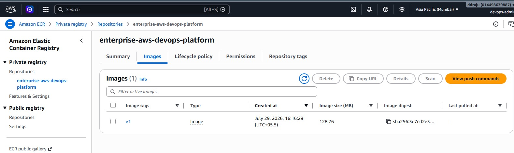
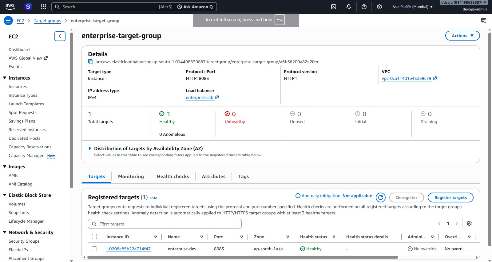
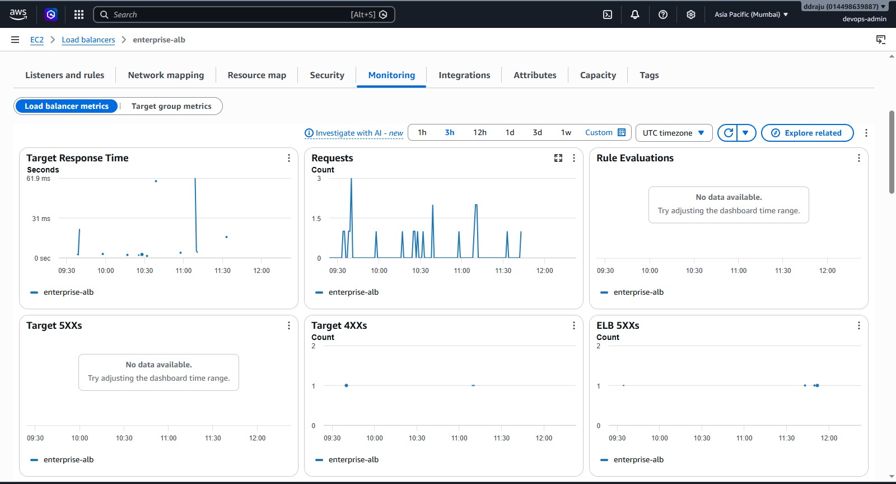
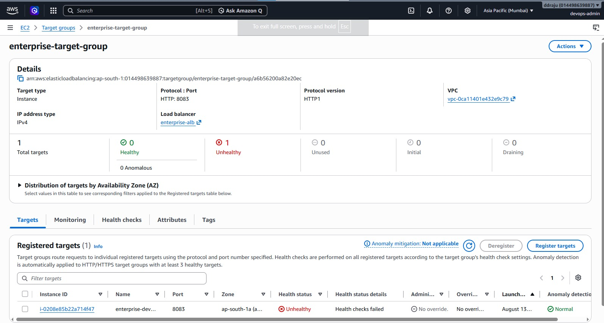
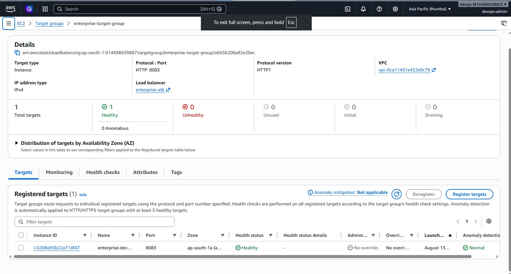

# Enterprise AWS DevOps Platform

A production-inspired DevOps platform that automates application build, containerization, deployment, infrastructure provisioning, load balancing, monitoring, alerting, failure detection, and recovery on AWS.

---

## Table of Contents

- [Overview](#overview)
- [Documentation](#documentation)
- [Project Objectives](#project-objectives)
- [Architecture](#architecture)
- [Technology Stack](#technology-stack)
- [AWS Infrastructure](#aws-infrastructure)
- [Repository Structure](#repository-structure)
- [Application](#application)
- [Infrastructure as Code](#infrastructure-as-code)
- [CI/CD Pipeline](#cicd-pipeline)
- [Docker and Amazon ECR](#docker-and-amazon-ecr)
- [Deployment with AWS Systems Manager](#deployment-with-aws-systems-manager)
- [Application Load Balancer](#application-load-balancer)
- [CloudWatch Monitoring](#cloudwatch-monitoring)
- [CloudWatch Alarms](#cloudwatch-alarms)
- [SNS Alerting](#sns-alerting)
- [Failure and Recovery Testing](#failure-and-recovery-testing)
- [SSM Troubleshooting Incident](#ssm-troubleshooting-incident)
- [Security](#security)
- [Git Branch Strategy](#git-branch-strategy)
- [Validation Results](#validation-results)
- [Deployment Workflow](#deployment-workflow)
- [Infrastructure Cleanup](#infrastructure-cleanup)
- [Final Project State](#final-project-state)
- [Future Improvements](#future-improvements)
- [Interview Summary](#interview-summary)

---

## Overview

The **Enterprise AWS DevOps Platform** demonstrates an end-to-end DevOps workflow for deploying a containerized Spring Boot application to AWS.

The platform automates the journey from source code to a running, monitored application:

```text
Developer
    |
    v
GitHub
    |
    v
GitHub Actions
    |
    +------------------------------+
    |                              |
    v                              v
Maven Build                   Docker Build
                                   |
                                   v
                              Amazon ECR
                                   |
                                   v
                         AWS Systems Manager
                                   |
                                   v
                              Amazon EC2
                                   |
                                   v
                           Docker Container
                                   |
                                   v
                         Spring Boot :8083
                                   |
                                   v
                     Application Load Balancer
                                   |
                                   v
                            /health -> 200
```

Monitoring operates alongside the deployment path:

```text
EC2 / Application / ALB
          |
          v
     CloudWatch
      /   |    \
   Logs Metrics Alarms
                  |
                  v
                 SNS
                  |
                  v
                Email
```

---

## Project Objectives

The project was built to demonstrate practical DevOps capabilities across development, infrastructure, deployment, operations, and recovery.

### Core objectives

- Provision AWS infrastructure using Terraform.
- Build and package a Spring Boot application.
- Containerize the application using Docker.
- Automate CI/CD using GitHub Actions.
- Store Docker images in Amazon ECR.
- Deploy to EC2 using AWS Systems Manager instead of normal SSH-based deployment.
- Expose the application through an Application Load Balancer.
- Implement application health checks.
- Monitor infrastructure and application-related metrics using CloudWatch.
- Centralize logs with CloudWatch.
- Configure CloudWatch alarms.
- Send alert notifications through Amazon SNS.
- Test intentional application failure.
- Validate monitoring and recovery behavior.
- Troubleshoot an actual SSM deployment incident.
- Destroy the AWS environment after project validation to avoid unnecessary ongoing costs.

---

## Architecture

### End-to-End Architecture

```text
                         +----------------+
                         |    Developer   |
                         +-------+--------+
                                 |
                                 v
                         +----------------+
                         |     GitHub     |
                         +-------+--------+
                                 |
                                 v
                      +-----------------------+
                      |    GitHub Actions     |
                      |-----------------------|
                      | Checkout              |
                      | Java 17               |
                      | Maven Build           |
                      | Docker Build          |
                      | ECR Push              |
                      | SSM Deployment        |
                      | Health Validation     |
                      +-----------+-----------+
                                  |
                                  v
                         +----------------+
                         |   Amazon ECR   |
                         +-------+--------+
                                 |
                                 v
                         +----------------+
                         |      SSM       |
                         +-------+--------+
                                 |
                                 v
                         +----------------+
                         |      EC2       |
                         |----------------|
                         | Docker         |
                         | Spring Boot    |
                         | :8083          |
                         +-------+--------+
                                 |
                                 v
                    +---------------------------+
                    | Application Load Balancer |
                    |           :80              |
                    +-------------+-------------+
                                  |
                                  v
                            /health -> 200
```

### Monitoring Architecture

```text
                     +-------------------+
                     | EC2 / Docker App  |
                     +---------+---------+
                               |
                               v
                     +-------------------+
                     |    CloudWatch     |
                     +---------+---------+
                               |
                +--------------+--------------+
                |              |              |
                v              v              v
              Logs          Metrics         Alarms
                                              |
                                              v
                                     +----------------+
                                     |      SNS       |
                                     +-------+--------+
                                             |
                                             v
                                           Email
```

### AWS Network Architecture

```text
                         Internet
                            |
                            v
                   +----------------+
                   | Internet GW    |
                   +-------+--------+
                           |
                           v
                  +-------------------+
                  |       VPC         |
                  |                   |
                  |  Public Subnets   |
                  |   +-----------+   |
                  |   |    ALB    |   |
                  |   +-----+-----+   |
                  |         |         |
                  |   +-----v-----+   |
                  |   |    EC2    |   |
                  |   +-----------+   |
                  |                   |
                  |  Private Subnet   |
                  |       |            |
                  |       v            |
                  |  NAT Gateway       |
                  +-------------------+
```

---

## Project Evidence

Selected screenshots from the actual implementation are included below. They are intentionally limited to the most useful evidence so the README remains concise and recruiter-friendly.

### Infrastructure



### CI/CD



### Amazon ECR



### Application Load Balancer



### Monitoring



### Failure and Recovery





> Detailed implementation evidence is available in the [`docs/`](docs/) directory, with screenshots embedded contextually in each document.

---

## Documentation

Detailed technical documentation is organized by capability:

| Document | Coverage |
|---|---|
| [`architecture.md`](docs/architecture.md) | End-to-end architecture and AWS component relationships |
| [`infrastructure.md`](docs/infrastructure.md) | Terraform-managed AWS networking, compute, IAM, and infrastructure |
| [`ci-cd-pipeline.md`](docs/ci-cd-pipeline.md) | GitHub Actions build, test, image, and deployment workflow |
| [`deployment.md`](docs/deployment.md) | ECR, SSM deployment, validation, and rollback considerations |
| [`application-load-balancer.md`](docs/application-load-balancer.md) | ALB listeners, target groups, health checks, and validation |
| [`monitoring.md`](docs/monitoring.md) | CloudWatch metrics, logs, alarms, dashboards, and SNS |
| [`security.md`](docs/security.md) | IAM, security groups, network boundaries, and deployment security |
| [`failure-recovery.md`](docs/failure-recovery.md) | Intentional failure testing, alerting, recovery, and SSM incident analysis |
| [`troubleshooting.md`](docs/troubleshooting.md) | Common operational issues and systematic troubleshooting |


---

## Technology Stack

| Category | Technology |
|---|---|
| Application | Java 17 / Spring Boot |
| Build Tool | Maven |
| Version Control | Git / GitHub |
| Containerization | Docker |
| CI/CD | GitHub Actions |
| Cloud Provider | Amazon Web Services |
| Infrastructure as Code | Terraform |
| Container Registry | Amazon ECR |
| Compute | Amazon EC2 |
| Deployment | AWS Systems Manager |
| Load Balancing | Application Load Balancer |
| Monitoring | Amazon CloudWatch |
| Alerting | Amazon SNS |
| Networking | Amazon VPC |
| Operating System | Amazon Linux |

---

## AWS Infrastructure

Terraform manages the AWS infrastructure used by the project.

### Networking

The infrastructure includes:

- Amazon VPC
- Public subnets
- Private subnet
- Internet Gateway
- NAT Gateway
- Elastic IP
- Public route table
- Private route table
- Route associations
- Security groups

### Compute

The application runs on an EC2 instance inside a Docker container:

```text
EC2
 |
 +-- Docker
      |
      +-- enterprise-app
            |
            +-- Spring Boot :8083
```

### Load Balancing

The Application Load Balancer provides the application entry point:

```text
Internet
   |
   v
ALB :80
   |
   v
Target Group
   |
   v
EC2 :8083
   |
   v
Docker
   |
   v
Spring Boot
```

### Observability

CloudWatch provides:

- Metrics
- Logs
- Dashboard
- Alarms

SNS provides:

- Email alert notifications

---

## Repository Structure

The repository is organized around application, infrastructure, automation, and documentation components.

A representative final structure is:

```text
enterprise-aws-devops-platform/
|
+-- .github/
|   |
|   +-- workflows/
|       |
|       +-- ci.yml
|
+-- application/
|   |
|   +-- Spring Boot application
|
+-- terraform/
|   |
|   +-- AWS infrastructure definitions
|   +-- VPC and networking
|   +-- IAM
|   +-- EC2
|   +-- ECR
|   +-- ALB
|   +-- CloudWatch
|   +-- SNS
|   +-- Security Groups
|
+-- docs/
|   |
|   +-- Project documentation
|
+-- Dockerfile
+-- README.md
```

The exact directory structure should be kept synchronized with the repository as files evolve.

---

## Application

The application is a Spring Boot service packaged as a Docker container.

The application listens on:

```text
8083
```

The health endpoint used by the load balancer and deployment validation is:

```text
/health
```

A successful health check returns:

```text
HTTP 200
```

The application is deployed in the container:

```text
enterprise-app
```

---

## Infrastructure as Code

Terraform is used to provision and manage the AWS infrastructure.

### Terraform workflow

```bash
cd terraform

terraform init

terraform validate

terraform plan

terraform apply
```

### Review changes

Before applying infrastructure changes:

```bash
terraform plan
```

Always review:

- Resources to add
- Resources to change
- Resources to destroy

### Destroy infrastructure

After completing a temporary project environment:

```bash
terraform plan -destroy

terraform destroy
```

The final project environment was intentionally destroyed after validation.

---

## CI/CD Pipeline

The final CI/CD workflow is:

```text
.github/workflows/ci.yml
```

The workflow supports pushes to the project's main deployment branch and the relevant feature branches. It also supports manual execution where configured.

### Pipeline stages

```text
Git Push
   |
   v
Checkout
   |
   v
Setup Java 17
   |
   v
Maven Build
   |
   v
Upload JAR Artifact
   |
   v
Configure AWS Credentials
   |
   v
Authenticate with ECR
   |
   v
Generate Docker Tags
   |
   v
Docker Buildx
   |
   v
Build + Push Docker Image
   |
   v
Deploy with SSM
   |
   v
Health Validation
   |
   v
ALB Validation
```

### Main branch deployment

The final implementation added `main` as a CI/CD trigger.

The final validation confirmed:

```text
Push to main
    |
    v
GitHub Actions
    |
    v
Deployment
    |
    v
EC2
    |
    v
ALB
    |
    v
Healthy
```

This confirms that the integrated `main` branch is independently deployable.

---

## Docker and Amazon ECR

### Docker

The Spring Boot application is packaged as a Docker image.

The deployment container uses:

```text
enterprise-app
```

and exposes:

```text
8083
```

### Amazon ECR

Amazon Elastic Container Registry is used as the private container registry.

The CI/CD workflow:

1. Authenticates with ECR.
2. Builds the Docker image.
3. Applies versioned tags.
4. Pushes the image to ECR.
5. Makes the image available to the EC2 deployment process.

### Image versioning

The workflow uses tags that allow deployments to identify the source revision.

Example:

```text
<account>.dkr.ecr.<region>.amazonaws.com/enterprise-aws-devops-platform:<commit-sha>
```

The commit SHA provides a direct relationship between a deployed container image and its source code revision.

---

## Deployment with AWS Systems Manager

The final deployment mechanism uses **AWS Systems Manager (SSM)** instead of a normal SSH-based deployment.

### Deployment flow

```text
GitHub Actions
      |
      v
Amazon ECR
      |
      v
AWS Systems Manager
      |
      v
EC2
      |
      +-- Authenticate with ECR
      |
      +-- Pull Docker image
      |
      +-- Stop previous container
      |
      +-- Remove previous container
      |
      +-- Start new container
      |
      +-- Validate application
```

### Why SSM?

Using SSM for deployment avoids making inbound SSH access a normal requirement of the CI/CD pipeline.

The intended operational model is:

```text
GitHub Actions
      |
      v
SSM
      |
      v
EC2
```

instead of:

```text
GitHub Actions
      |
      v
SSH :22
      |
      v
EC2
```

Temporary SSH access was used during troubleshooting only and was removed after recovery.

---

## Application Load Balancer

The Application Load Balancer provides the public application entry point.

```text
Internet
   |
   v
ALB :80
   |
   v
Target Group
   |
   v
EC2 :8083
   |
   v
Docker Container
   |
   v
Spring Boot
```

### Health Check

The target group uses:

```text
/health
```

The final validation confirmed:

```text
Port: 8083
State: healthy
Target: EC2 instance
```

and:

```text
/health -> HTTP 200
```

### Why an ALB?

The ALB provides:

- A stable public endpoint
- Target health monitoring
- Health-based traffic routing
- A foundation for future scaling
- Separation between public traffic and the EC2 application port

---

## CloudWatch Monitoring

CloudWatch provides centralized monitoring for the platform.

The final monitoring implementation covers both EC2 and ALB health.

### Monitoring components

- CloudWatch Logs
- EC2 CPU monitoring
- Memory metrics
- Disk metrics
- ALB metrics
- CloudWatch Dashboard
- CloudWatch Alarms
- Log retention

### Monitoring flow

```text
EC2
 |
 +-- CPU
 +-- Memory
 +-- Disk
 +-- Application Logs
 |
 v
CloudWatch
```

ALB metrics are also monitored:

```text
ALB
 |
 +-- 5xx errors
 +-- Response time
 +-- Healthy targets
 +-- Unhealthy targets
 |
 v
CloudWatch
```

---

## CloudWatch Alarms

The final implementation includes alarms for key failure conditions.

### EC2

```text
enterprise-devops-ec2-high-cpu
```

Detects excessive EC2 CPU utilization.

### ALB

```text
enterprise-devops-alb-5xx-errors
```

Detects elevated ALB 5xx errors.

```text
enterprise-devops-alb-high-response-time
```

Detects elevated application response time.

```text
enterprise-devops-alb-no-healthy-targets
```

Detects when the target group has no healthy targets.

```text
enterprise-devops-alb-unhealthy-targets
```

Detects unhealthy application targets.

### Alarm lifecycle

```text
Normal
  |
  v
OK
  |
  v
Failure Condition
  |
  v
ALARM
  |
  v
SNS Notification
  |
  v
Recovery
  |
  v
OK
```

---

## SNS Alerting

CloudWatch alarms are connected to an Amazon SNS topic.

```text
CloudWatch Alarm
       |
       v
SNS Topic
       |
       v
Email Subscription
       |
       v
Email Notification
```

The SNS email subscription was confirmed during project validation.

This provides an operational notification path when important infrastructure or application health conditions change.

---

## Failure and Recovery Testing

Monitoring was tested using an intentional application failure.

### Failure injection

The application container was intentionally stopped.

```text
enterprise-app
       |
       v
Stopped
```

### Expected system behavior

```text
Application stops
       |
       v
ALB target becomes unhealthy
       |
       v
CloudWatch alarm enters ALARM
       |
       v
SNS sends notification
```

### Recovery

After deployment/recovery:

```text
Application restored
       |
       v
ALB target becomes healthy
       |
       v
CloudWatch alarm returns to OK
```

### Result

The project successfully demonstrated:

```text
Failure
  |
  v
Detection
  |
  v
Alert
  |
  v
Recovery
  |
  v
Healthy State
```

This validates the monitoring implementation rather than merely proving that alarms exist.

---

## SSM Troubleshooting Incident

During final validation, one SSM deployment became stuck in:

```text
InProgress
```

The EC2 instance was subsequently rebooted, but the stale SSM command remained associated with the instance.

### Investigation

The following were verified:

- SSM Agent service was active.
- EC2 instance profile credentials were available.
- SSM Agent successfully identified the instance as EC2.
- The SSM control channel was successfully established.
- Network connectivity to the SSM messages endpoint was available.

The agent logs showed that an old in-progress document was being resumed.

The logs then showed:

```text
process ... not found
```

followed by:

```text
ipc messaging received timeout signal
```

### Resolution

The stale command state was cleared and SSM functionality was tested again with a small command.

The SSM test succeeded.

The final `main` branch workflow was then executed again and successfully:

- Built the application.
- Built and pushed the Docker image.
- Deployed through SSM.
- Started the application.
- Passed ALB health validation.

### Lesson

The incident demonstrated the importance of distinguishing between:

- EC2 health
- SSM Agent health
- SSM network connectivity
- SSM command execution state
- Application health
- ALB target health

A failed deployment does not automatically mean that the underlying infrastructure is broken.

---

## Security

Security was considered throughout the project.

### IAM

AWS IAM roles and policies are used to provide the required permissions to EC2 and the CI/CD process.

### SSM instead of normal SSH deployment

The final deployment architecture uses:

```text
GitHub Actions
      |
      v
SSM
      |
      v
EC2
```

rather than requiring a permanent inbound SSH path.

### Security Groups

Security groups restrict inbound and outbound traffic according to the application's requirements.

During troubleshooting, temporary SSH access was added to recover the EC2 instance.

After the issue was resolved:

```text
Temporary SSH rule
        |
        v
Removed
```

The final security configuration therefore did not retain the temporary SSH access.

---

## Git Branch Strategy

Development was organized using feature branches.

Important branches included:

```text
main

feature/vpc-networking
feature/security-compute
feature/docker-deployment
feature/amazon-ecr
feature/github-actions-cicd
feature/application-load-balancer
feature/cloudwatch-monitoring
```

### CloudWatch branch

The following branch is intentionally retained:

```text
feature/cloudwatch-monitoring
```

It contains part of the development history for:

- CloudWatch monitoring
- CloudWatch alarms
- Dashboard
- SNS
- SSM deployment
- CI/CD changes

The completed work was merged into `main`.

The feature branch is intentionally preserved as project history and is not required to be deleted after the merge.

---

## Validation Results

The final implementation was validated through the following tests.

| Validation | Result |
|---|---|
| Terraform provisioning | Passed |
| Terraform plan after implementation | No drift |
| GitHub Actions deployment | Passed |
| `main` branch deployment | Passed |
| Docker image build | Passed |
| ECR image push | Passed |
| SSM deployment | Passed |
| EC2 application startup | Passed |
| ALB target health | Healthy |
| `/health` endpoint | HTTP 200 |
| CloudWatch dashboard | Verified |
| CloudWatch alarms | Verified |
| SNS subscription | Confirmed |
| Intentional application failure | Verified |
| ALB unhealthy detection | Verified |
| CloudWatch ALARM transition | Verified |
| Application recovery | Verified |
| CloudWatch recovery to OK | Verified |
| Temporary SSH rule removal | Completed |
| Terraform destroy | Completed |
| Terraform state cleanup | Completed |

---

## Deployment Workflow

### Prerequisites

Before recreating the environment, ensure the following are available:

- AWS account
- AWS CLI
- Terraform
- Docker
- Git
- GitHub repository
- Appropriate AWS credentials
- Required GitHub Actions secrets/variables
- Java 17 / Maven for local application development

### Clone repository

```bash
git clone https://github.com/Nagaraju-209/enterprise-aws-devops-platform.git

cd enterprise-aws-devops-platform
```

### Provision infrastructure

```bash
cd terraform

terraform init

terraform validate

terraform plan

terraform apply
```

### Deploy

Push the application changes to the configured deployment branch.

GitHub Actions will:

```text
Build
  |
Test/Package
  |
Docker Build
  |
ECR Push
  |
SSM Deployment
  |
Health Validation
```

### Verify ALB

After deployment, verify that the target becomes healthy.

The application health endpoint is:

```text
/health
```

---

## Infrastructure Cleanup

When the environment is no longer required:

```bash
cd terraform

terraform plan -destroy

terraform destroy
```

After destruction:

```bash
terraform state list
```

The final project environment was destroyed successfully and the Terraform state was left empty.

> **Important:** Do not run `terraform destroy` against a shared or production environment without first reviewing the destroy plan and confirming that the resources are safe to remove.

---

## Final Project State

The project has been completed and the temporary AWS infrastructure has been destroyed.

```text
AWS Infrastructure
        |
        v
    Destroyed
```

The source code and Git history remain preserved:

```text
GitHub Repository
       |
       +-- main
       |
       +-- feature/cloudwatch-monitoring
       |
       +-- Other feature branches
```

The final state is therefore:

```text
AWS Infrastructure       -> Destroyed
Terraform State           -> Empty
GitHub Repository         -> Preserved
main Branch               -> Preserved
CloudWatch Branch         -> Preserved
Project Implementation    -> Complete
```

Destroying the environment prevents unnecessary AWS costs while retaining the complete implementation for future recreation.

---

## Future Improvements

The following are potential extensions rather than requirements for the completed project:

### 1. Remote Terraform State

Use:

- Amazon S3
- Terraform state locking

to support collaborative infrastructure management.

### 2. Environment Separation

Create separate:

```text
dev
staging
production
```

environments.

### 3. Blue/Green or Rolling Deployment

Introduce safer deployment strategies that minimize downtime.

### 4. Automated Rollback

Automatically roll back when:

- SSM deployment fails.
- The container fails to start.
- ALB health checks fail.

### 5. GitHub Actions OIDC

Use GitHub Actions OIDC with AWS IAM instead of long-lived AWS credentials.

### 6. Security Scanning

Integrate:

- Trivy
- Dependency scanning
- Secret scanning
- SAST

into the CI/CD pipeline.

### 7. Secrets Management

Use:

- AWS Secrets Manager
- AWS Systems Manager Parameter Store

for sensitive configuration.

### 8. Auto Scaling

Introduce:

- EC2 Auto Scaling Group
- Multiple application instances
- ALB-based distribution

### 9. HTTPS

Add:

- AWS Certificate Manager
- HTTPS listener
- Route 53
- Custom domain

### 10. Advanced Observability

Add:

- Distributed tracing
- Application-level metrics
- OpenTelemetry
- Prometheus/Grafana integration

---

## Interview Summary

### 30-second explanation

> I built a production-inspired AWS DevOps platform for deploying a containerized Spring Boot application. I used Terraform to provision the AWS infrastructure, GitHub Actions for CI/CD, Docker and Amazon ECR for containerization and image management, and AWS Systems Manager for secure EC2 deployment. The application is exposed through an Application Load Balancer with health checks, while CloudWatch monitors EC2 and ALB metrics and triggers SNS email alerts. I also intentionally stopped the application to validate unhealthy-target detection, CloudWatch alarms, notifications, and recovery.

### Deployment explanation

```text
Developer
   |
   v
GitHub
   |
   v
GitHub Actions
   |
   +-- Maven Build
   |
   +-- Docker Build
   |
   +-- ECR Push
   |
   v
SSM
   |
   v
EC2
   |
   v
Docker
   |
   v
Spring Boot
   |
   v
ALB
   |
   v
Health Check
```

### Monitoring explanation

```text
EC2 + ALB
    |
    v
CloudWatch
    |
    +-- Metrics
    +-- Logs
    +-- Dashboard
    +-- Alarms
             |
             v
            SNS
             |
             v
           Email
```

### Strong interview points

Be prepared to explain:

- Why Terraform?
- Why Docker?
- Why ECR?
- Why SSM instead of SSH?
- How GitHub Actions authenticates with AWS.
- How the Docker image is versioned.
- How the deployment reaches EC2.
- How ALB health checks work.
- How CloudWatch detects failures.
- How SNS notifications work.
- How you tested monitoring.
- How you diagnosed the SSM timeout.
- Why the SSM agent can be healthy while an individual command fails.
- How you removed temporary SSH access.
- How you would improve the architecture for production.

---

## Project Completion

**Enterprise AWS DevOps Platform — COMPLETE**

The project demonstrates an end-to-end workflow covering:

```text
Infrastructure as Code
        +
Containerization
        +
CI/CD
        +
AWS Cloud
        +
Secure Deployment
        +
Load Balancing
        +
Monitoring
        +
Alerting
        +
Failure Testing
        +
Recovery
```

The AWS environment has been intentionally destroyed after successful validation, while the GitHub repository and complete development history remain preserved.
