# 🚀 Enterprise AWS DevOps Platform

> A production-style AWS DevOps platform built from scratch using Terraform, AWS, Docker, and modern DevOps best practices.


---

# 📖 Project Overview

This project demonstrates how to provision and manage a production-ready AWS infrastructure using **Infrastructure as Code (Terraform)**.

The platform is being built incrementally following real-world DevOps practices, including:

- Infrastructure as Code
- Git Feature Branch Workflow
- Secure Networking
- IAM Best Practices
- Automated EC2 Bootstrapping
- Docker-based Application Deployment
- CI/CD Pipelines (Upcoming)
- Monitoring & Logging (Upcoming)

---

# 🏗️ Architecture

```
                        Internet
                            │
                     Internet Gateway
                            │
                    Public Route Table
                            │
                    Public Subnet
                            │
                 Public Security Group
                            │
                     Amazon Linux EC2
                            │
        ┌──────────────┬──────────────┬──────────────┐
        │              │              │
      Docker          Git          AWS CLI
                            │
                 IAM Instance Profile
                            │
             AmazonSSMManagedInstanceCore

Private Subnet
      │
 NAT Gateway
      │
 Internet Gateway
```

---

# 🛠️ Tech Stack

### Cloud

- AWS EC2
- AWS VPC
- Internet Gateway
- NAT Gateway
- Elastic IP
- IAM
- Systems Manager (SSM)

### Infrastructure as Code

- Terraform

### Operating System

- Amazon Linux 2023

### DevOps Tools

- Docker
- Git
- AWS CLI

---

# 📂 Project Structure

```
enterprise-aws-devops-platform/

├── terraform/
│   ├── provider.tf
│   ├── variables.tf
│   ├── terraform.tfvars
│   ├── versions.tf
│   ├── vpc.tf
│   ├── subnet.tf
│   ├── internet-gateway.tf
│   ├── route-tables.tf
│   ├── nat-gateway.tf
│   ├── security-groups.tf
│   ├── key-pair.tf
│   ├── iam.tf
│   ├── ec2.tf
│   ├── userdata.sh
│   └── outputs.tf
│
├── keys/
│
├── screenshots/
│
└── README.md
```

---

# ✅ Module Progress

## ✅ Module 1 — AWS Foundation

Completed

- AWS Account Setup
- IAM User
- MFA Configuration
- AWS CLI Configuration
- GitHub Repository Setup

---

## ✅ Module 2 — Terraform Foundation

Completed

- Terraform Installation
- AWS Provider Configuration
- Variables
- Outputs
- State Management

---

## ✅ Module 3 — AWS Networking

Completed

### VPC

- Custom VPC

### Networking

- Public Subnet
- Private Subnet
- Internet Gateway
- NAT Gateway
- Elastic IP

### Routing

- Public Route Table
- Private Route Table
- Route Table Associations

---

## ✅ Module 4 — Security & Compute

Completed

### Security

- Public Security Group
- Application Security Group

### Access

- SSH Key Pair
- IAM Role
- IAM Instance Profile

### Compute

- Amazon Linux 2023 EC2 Instance

### Bootstrap

Automatically installs

- Docker
- Git
- AWS CLI

using EC2 User Data.

---

# 🔒 Security Design

## Public Security Group

Allows

- SSH (22)
- HTTP (80)
- HTTPS (443)

## Application Security Group

Allows

- Port 8080
- Only from Public Security Group

---

# 🔑 IAM

Created using Terraform

- IAM Role
- Instance Profile
- AmazonSSMManagedInstanceCore Policy

This allows secure Systems Manager access without embedding AWS credentials.

---

# 🖥️ EC2 Bootstrap

The EC2 instance is automatically configured during launch using **User Data**.

Installed software

- Docker
- Git
- AWS CLI

Docker service is enabled automatically.

---

# ✅ Verification

Verified after deployment

```
Docker version 25.0.14
```

```
Git version 2.50.1
```

```
AWS CLI 2.33.15
```

---

# 🐛 Troubleshooting

## Issue

During the first deployment, the EC2 bootstrap process failed.

Cloud-init reported an error while executing:

```bash
dnf install docker git unzip curl wget
```

Amazon Linux 2023 includes **curl-minimal** by default, which conflicts with installing the full `curl` package.

As a result:

- Docker was not installed
- Git was not installed
- Cloud-init exited before completing the bootstrap process

## Resolution

Updated the User Data script by removing the `curl` package from the installation command.

```bash
dnf install -y docker git unzip wget
```

After redeploying, the bootstrap completed successfully.

This exercise demonstrates troubleshooting of cloud-init logs and package dependency conflicts on Amazon Linux 2023.

---

# 📸 Screenshots

## Module 3 – AWS Networking

| VPC | Public Subnet |
|------|---------------|
|  | 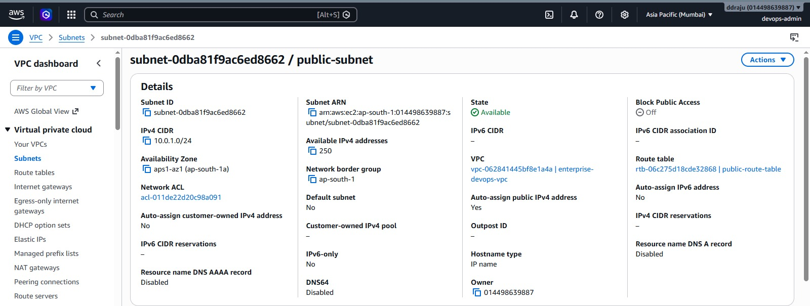 |

| Private Subnet | Internet Gateway |
|----------------|------------------|
| 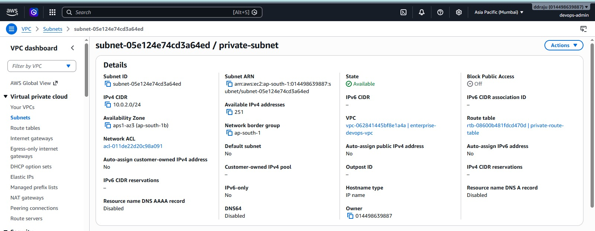 | 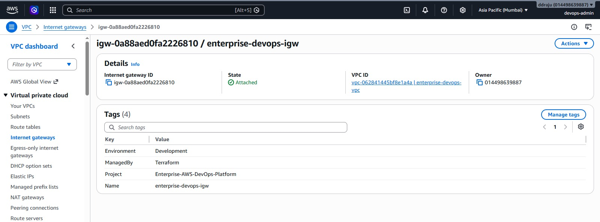 |

| Public Route Table | Private Route Table |
|--------------------|---------------------|
| 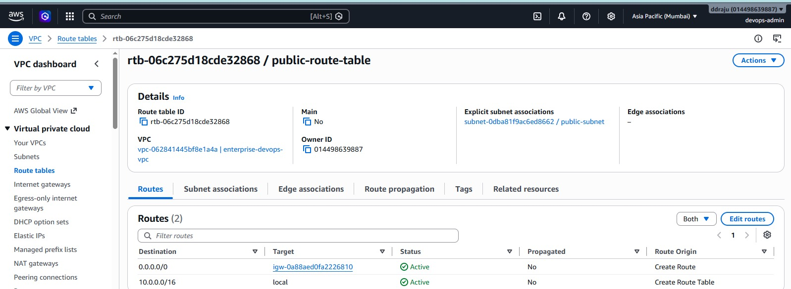 | 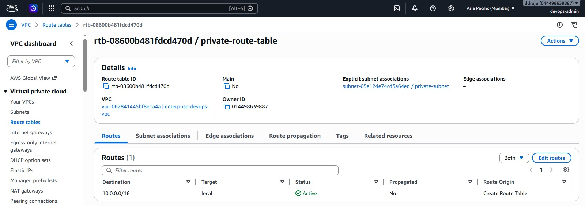 |

| NAT Gateway | Elastic IP |
|-------------|------------|
| 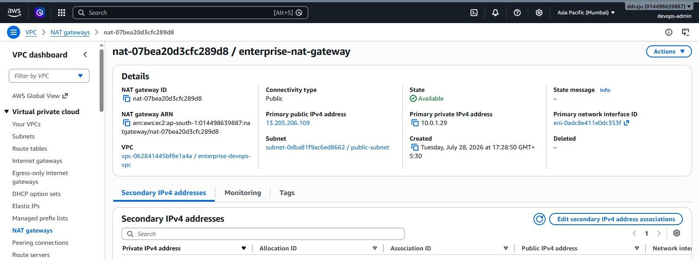 | 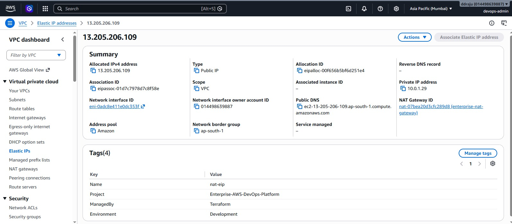 |

### Terraform Provisioning

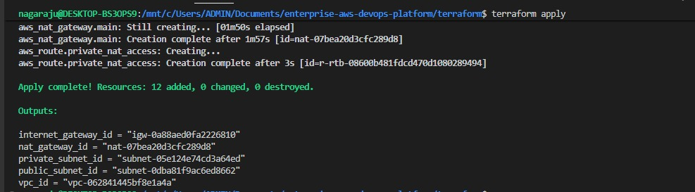

---

## Module 4 – Security & Compute

### Infrastructure

| VPC | Public Subnet |
|------|---------------|
| 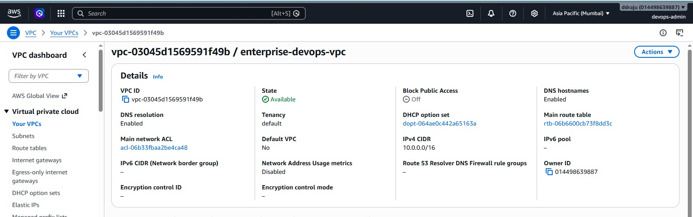 | 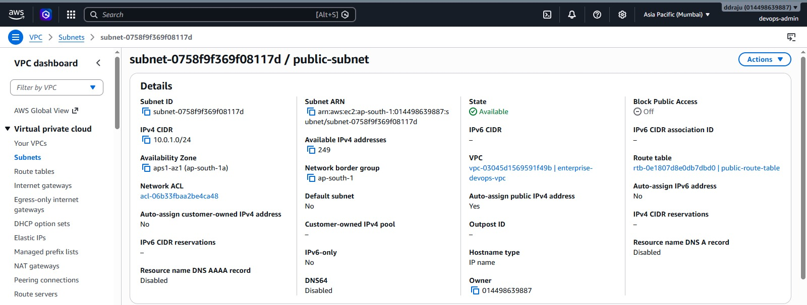 |

| Private Subnet | Internet Gateway |
|----------------|------------------|
| 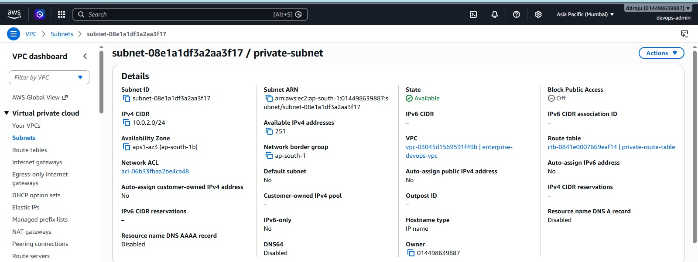 | 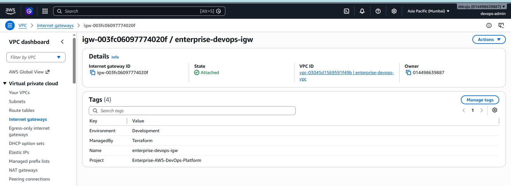 |

| Public Route Table | Private Route Table |
|--------------------|---------------------|
|  | 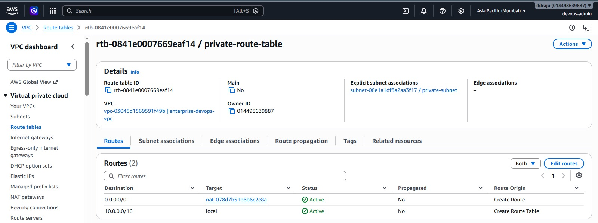 |

| NAT Gateway | EC2 Instance |
|-------------|--------------|
| 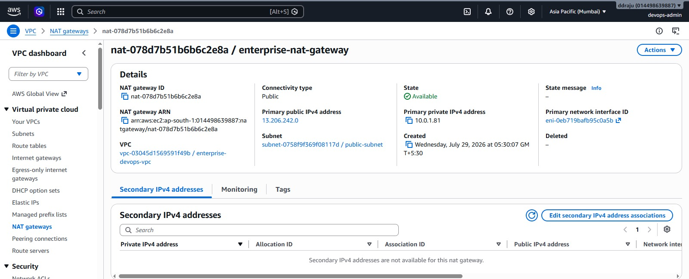 | 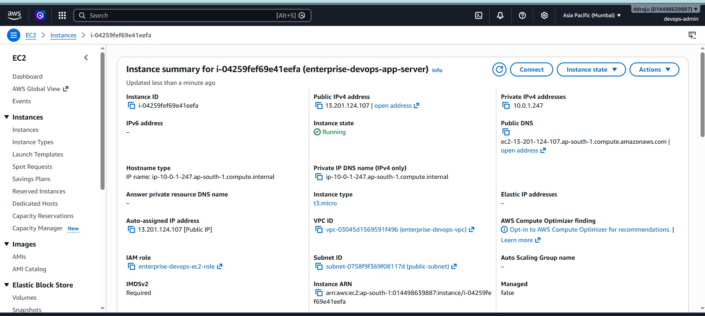 |

---

### Security

| Public Security Group | Application Security Group |
|-----------------------|----------------------------|
| 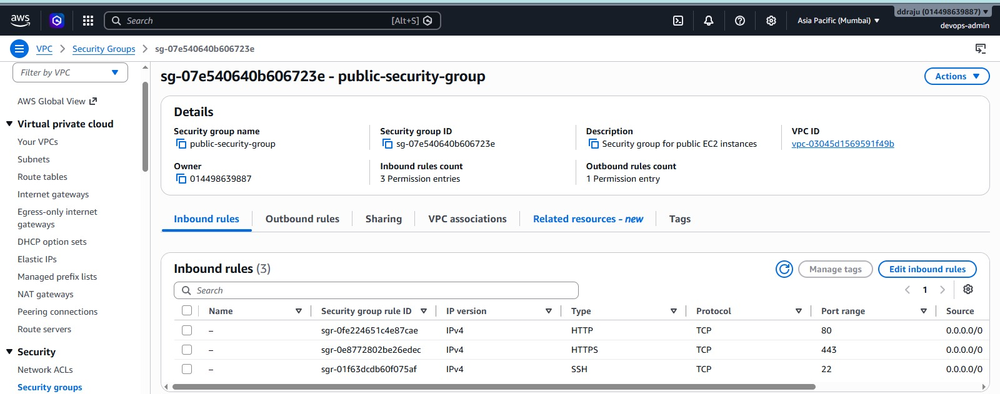 | 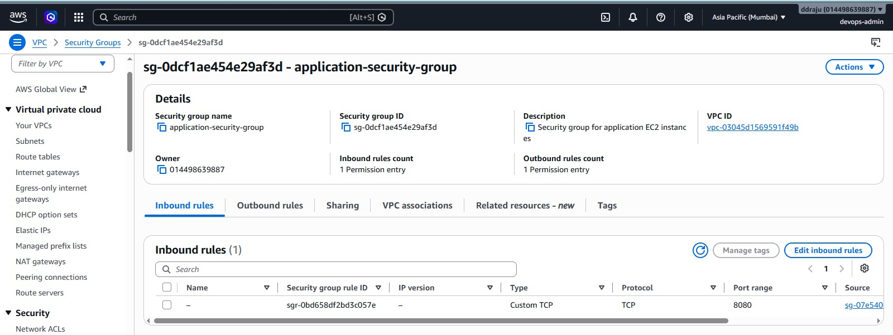 |

| IAM Role |
|----------|
| 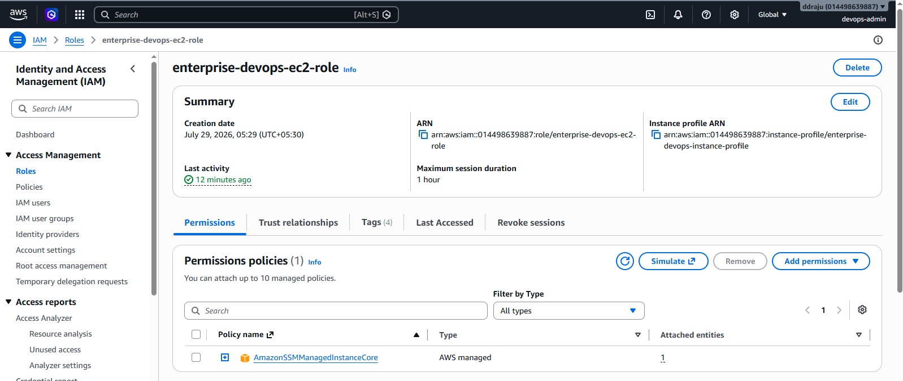 |

---

### Deployment Verification

| SSH Connection | Docker, Git & AWS CLI Verification |
|----------------|------------------------------------|
| 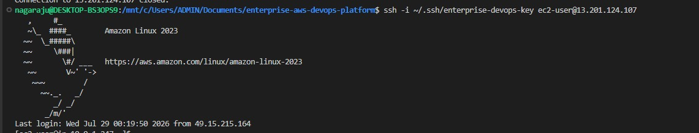 | 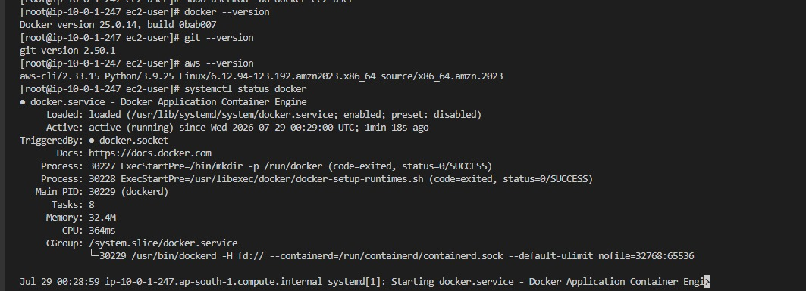 |

---

### Terraform Apply

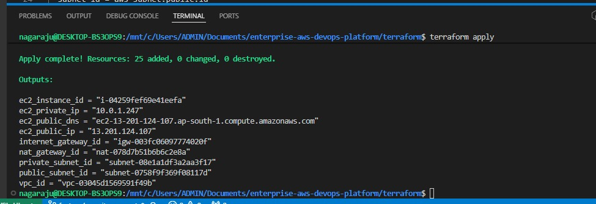

---

# 🚀 Upcoming Modules

- Module 5 — Docker Deployment
- Module 6 — Amazon ECR
- Module 7 — GitHub Actions CI/CD
- Module 8 — Monitoring & Logging
- Module 9 — Kubernetes Deployment
- Module 10 — Production Enhancements

---

# 👨‍💻 Author

**Dandu Rama Siva Naga Raju**

- LinkedIn: https://www.linkedin.com/in/dandu-rama-siva-naga-raju/
- GitHub: https://github.com/Nagaraju-209

---

⭐ If you found this project helpful, consider starring the repository!