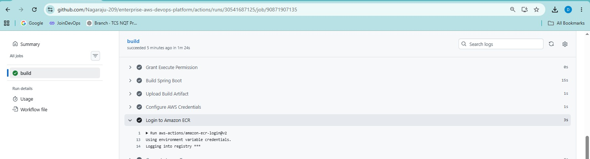

# CI/CD Pipeline

## Overview

The Enterprise AWS DevOps Platform uses GitHub Actions to automate the application build, container image creation, publishing, deployment, and post-deployment validation.

The final deployment architecture uses Amazon ECR and AWS Systems Manager (SSM) to deploy the containerized Spring Boot application to Amazon EC2.

```text
Git Push
   |
   v
GitHub Actions
   |
   +--------------------+
   |                    |
   v                    v
Maven Build        Docker Build
                         |
                         v
                    Amazon ECR
                         |
                         v
                AWS Systems Manager
                         |
                         v
                       EC2
                         |
                         v
                  Docker Container
                         |
                         v
                  Spring Boot :8083
                         |
                         v
                Application Load Balancer
                         |
                         v
                    Health Check
```

The final implementation was validated through successful workflow execution and ALB target health validation.

---

## Pipeline Goals

The CI/CD pipeline is responsible for:

- Checking out the application source code.
- Setting up the Java build environment.
- Building the Spring Boot application with Maven.
- Packaging the application artifact.
- Building the Docker image.
- Authenticating with Amazon ECR.
- Pushing the Docker image to ECR.
- Deploying the image to EC2 using AWS Systems Manager.
- Starting the application container.
- Validating application availability.
- Validating the ALB target health.

---

## Workflow File

The GitHub Actions workflow is located at:

```text
.github/workflows/ci.yml
```

The workflow was updated during the CloudWatch/SSM implementation to support the final deployment path.

The final Git history includes:

```text
15b3289  CI/CD: deploy to EC2 using SSM
d94dbbc  CI/CD: trigger monitoring branch deployment
fca7ac6  merge: complete cloudwatch monitoring and ssm deployment
```

The completed CloudWatch monitoring and SSM deployment work was merged into `main`.

---

## Workflow Triggers

The workflow is configured to run for pushes to the relevant project branches.

The final workflow includes:

```yaml
on:
  push:
    branches:
      - main
      - feature/github-actions-cicd
      - feature/application-load-balancer
      - feature/cloudwatch-monitoring
```

The `main` branch was added so that the completed integrated project can be deployed directly from the main branch.

The CloudWatch monitoring branch is intentionally retained for project history and is not required to be deleted after the merge.

---

## Pipeline Stages

The final pipeline can be represented as:

```text
1. Checkout
       |
       v
2. Java 17 Setup
       |
       v
3. Maven Build / Package
       |
       v
4. Docker Build
       |
       v
5. Authenticate with ECR
       |
       v
6. Push Image to ECR
       |
       v
7. Deploy through SSM
       |
       v
8. Application Validation
       |
       v
9. ALB Health Validation
```

---

# 1. Checkout

The workflow checks out the repository source code.

```text
GitHub Repository
       |
       v
GitHub Actions Runner
       |
       v
Application Source
```

This provides the runner with the source required for the build and Docker image creation.

---

# 2. Java 17 Setup

The application uses Java 17.

The CI workflow prepares the Java environment before running Maven commands.

```text
GitHub Actions Runner
        |
        v
Java 17
        |
        v
Maven
```

Using a consistent Java version between development and CI reduces build-environment differences.

---

# 3. Maven Build and Package

The Spring Boot application is built using Maven.

The Maven stage compiles the application and produces the deployable JAR artifact.

Conceptually:

```bash
mvn clean package
```

The resulting artifact is used as the application payload for the Docker image.

The build stage ensures that the application can be packaged successfully before the deployment stages begin.

---

# 4. Docker Build

After the application is successfully packaged, the workflow builds the Docker image.

```text
Spring Boot JAR
       |
       v
Dockerfile
       |
       v
Docker Image
```

The application container runs on port:

```text
8083
```

The deployment container is named:

```text
enterprise-app
```

---

# 5. Amazon ECR Authentication

The workflow authenticates with Amazon Elastic Container Registry.

```text
GitHub Actions
       |
       v
AWS Authentication
       |
       v
Amazon ECR Login
```

ECR is used as the private container image registry for the application.

---

# 6. Docker Image Tagging

The Docker image is tagged so that a deployment can be associated with a specific source revision.

The project uses the Git commit SHA as an image version identifier.

Example:

```text
<account>.dkr.ecr.<region>.amazonaws.com/enterprise-aws-devops-platform:<commit-sha>
```

This provides traceability between:

```text
Git Commit
    |
    v
Docker Image
    |
    v
ECR
    |
    v
EC2 Deployment
```

---

# 7. Push Image to Amazon ECR

The built Docker image is pushed to the ECR repository.

```text
Docker Build
     |
     v
Versioned Image
     |
     v
Amazon ECR
```

The EC2 deployment later pulls this image from ECR.

---

# 8. Deploy to EC2 Using AWS Systems Manager

The final deployment mechanism uses AWS Systems Manager instead of SSH.

```text
GitHub Actions
       |
       v
AWS Systems Manager
       |
       v
EC2 Instance
       |
       v
Docker
```

The deployment command performs the required container lifecycle operations on the EC2 instance.

Conceptually, the deployment performs:

```text
Authenticate with ECR
        |
        v
Pull new image
        |
        v
Stop previous container
        |
        v
Remove previous container
        |
        v
Start new container
        |
        v
Validate application
```

The application container is:

```text
enterprise-app
```

and the application listens on:

```text
8083
```

---

# Why AWS Systems Manager?

The project originally evolved through an SSH-based deployment approach, but the final implementation uses SSM.

### Previous model

```text
GitHub Actions
      |
      v
SSH :22
      |
      v
EC2
```

### Final model

```text
GitHub Actions
      |
      v
AWS Systems Manager
      |
      v
EC2
```

This removes the need for the normal CI/CD deployment path to depend on inbound SSH access.

SSM also provides an AWS-managed mechanism for executing commands on the EC2 instance.

---

# 9. Application Validation

After the container starts, the deployment process validates that the application is available.

The application health endpoint is:

```text
/health
```

The expected result is:

```text
HTTP 200
```

The validation flow is:

```text
Container Started
       |
       v
Spring Boot Started
       |
       v
/health
       |
       v
HTTP 200
```

A successful application health check indicates that the application process is responding.

---

# 10. ALB Health Validation

Application health is also validated through the Application Load Balancer target group.

The final target configuration uses:

```text
Port: 8083
Health Check: /health
```

The expected state is:

```text
healthy
```

The final validation produced a healthy target:

```text
Port   State     Target
8083   healthy   EC2 instance
```

This provides an additional deployment validation layer beyond checking only the local container.

---

# Deployment Validation Model

The final deployment validates the application at multiple levels.

```text
Level 1
Docker Container
      |
      v
Running
```

```text
Level 2
Application
      |
      v
/health -> HTTP 200
```

```text
Level 3
ALB Target
      |
      v
healthy
```

A successful deployment should therefore satisfy:

```text
Docker = Running
Application = Healthy
ALB Target = Healthy
```

---

# CI/CD Security

The final deployment architecture minimizes reliance on inbound SSH.

The intended production-style flow is:

```text
GitHub Actions
      |
      v
AWS APIs
      |
      v
SSM
      |
      v
EC2
```

Temporary SSH access was used during troubleshooting only.

During the troubleshooting incident, SSH access was restricted to a single `/32` source address and was subsequently revoked.

The temporary rule was:

```text
49.15.207.58/32
```

After removal, the security group retained the required application access instead of the temporary SSH rule.

---

# Failure Handling

A deployment can fail at multiple stages:

```text
Maven Build
    |
    X
Docker Build
    |
    X
ECR Push
    |
    X
SSM Deployment
    |
    X
Application Health Check
    |
    X
ALB Health Check
```

Each failure should be investigated at the layer where it occurs.

For example:

### Maven failure

Check:

- Java version
- Maven configuration
- Application compilation errors
- Test failures

### Docker failure

Check:

- Dockerfile
- Build context
- Application JAR
- Container configuration

### ECR failure

Check:

- AWS credentials
- ECR permissions
- Repository name
- Region
- Docker authentication


> **Evidence — ECR login**
>
> 

### SSM failure

Check:

- EC2 instance status
- SSM Agent status
- IAM instance profile
- SSM connectivity
- SSM command state
- Deployment command output

### ALB failure

Check:

- Application process
- Container port
- Security groups
- Target group
- Health-check path
- Health-check port

---

# SSM Deployment Incident

During final project validation, an SSM deployment became stuck in:

```text
InProgress
```

The EC2 instance was subsequently rebooted, but the old SSM command still appeared to be in progress.

The SSM Agent logs showed that it discovered the old in-progress document after the reboot.

The investigation showed:

```text
Found in-progress document
        |
        v
Original process no longer existed
        |
        v
IPC messaging timeout
        |
        v
SSM command failed
```

The important distinction was that the EC2 instance and SSM Agent themselves were healthy.

The agent successfully:

- Identified the EC2 instance.
- Loaded the instance profile credentials.
- Established the SSM control channel.
- Connected to the SSM messages endpoint.

The problem was associated with the stale command execution state rather than basic EC2 or SSM connectivity.

The stale command was cleared and SSM was tested again successfully.

---

# SSM Connectivity Validation

During troubleshooting, SSM Agent logs confirmed a successful WebSocket connection to:

```text
ssmmessages.ap-south-1.amazonaws.com
```

The endpoint was reachable from the EC2 instance.

This helped isolate the issue from a basic network connectivity problem.

The final successful deployment confirmed that the SSM deployment path was functioning correctly.

---

# Successful Final Deployment

The final deployment flow was successfully validated:

```text
Git Push
   |
   v
GitHub Actions
   |
   v
Maven Build
   |
   v
Docker Build
   |
   v
ECR Push
   |
   v
SSM Deployment
   |
   v
EC2
   |
   v
Docker Container
   |
   v
Spring Boot
   |
   v
ALB
   |
   v
Healthy
```

The final workflow succeeded and the ALB target was healthy.

---

# CI/CD and Monitoring Integration

The CI/CD pipeline is integrated with the monitoring architecture.

```text
                  CI/CD
                    |
                    v
              Deploy Application
                    |
                    v
                   EC2
                    |
                    v
                  ALB
                    |
          +---------+---------+
          |                   |
          v                   v
      Health Check         Metrics
                              |
                              v
                         CloudWatch
                              |
                              v
                            Alarms
                              |
                              v
                             SNS
                              |
                              v
                            Email
```

This means deployment is not treated as complete merely because a Docker command succeeded.

The application must also become healthy behind the ALB.

---

# Branch Strategy

The project uses feature branches during development.

Important branches include:

```text
main
feature/github-actions-cicd
feature/application-load-balancer
feature/cloudwatch-monitoring
```

The completed CloudWatch and SSM work was merged into:

```text
main
```

The `feature/cloudwatch-monitoring` branch is intentionally retained as development history.

---

# Final CI/CD Checklist

Before considering a deployment successful, verify:

```text
[ ] GitHub Actions workflow succeeded
[ ] Maven build succeeded
[ ] Docker image built successfully
[ ] Image pushed to ECR
[ ] SSM command completed successfully
[ ] EC2 container is running
[ ] Application responds on port 8083
[ ] /health returns HTTP 200
[ ] ALB target is healthy
```

For the final project validation, these checks were successfully completed.

---

# Troubleshooting Commands

## Check workflow state

Review the GitHub Actions workflow run and identify the failed stage.

---

## Check ECR images

```bash
aws ecr describe-images \
  --repository-name enterprise-aws-devops-platform \
  --region ap-south-1
```

---

## Check SSM command

```bash
aws ssm get-command-invocation \
  --command-id <command-id> \
  --instance-id <instance-id> \
  --query '{Status:Status,Output:StandardOutputContent,Error:StandardErrorContent}' \
  --output json
```

---

## Check SSM Agent

On EC2:

```bash
sudo systemctl status amazon-ssm-agent --no-pager -l
```

---

## Check SSM Agent logs

```bash
sudo journalctl -u amazon-ssm-agent --no-pager -n 100
```

or:

```bash
sudo tail -100 /var/log/amazon/ssm/amazon-ssm-agent.log
```

---

## Check Docker container

```bash
docker ps
```

---

## Check application logs

```bash
docker logs enterprise-app
```

---

## Check ALB target health

```bash
aws elbv2 describe-target-health \
  --target-group-arn "<target-group-arn>" \
  --query 'TargetHealthDescriptions[].{Target:Target.Id,Port:Target.Port,State:TargetHealth.State,Reason:TargetHealth.Reason}' \
  --output table
```

Expected result:

```text
Port   State
8083   healthy
```

---


> **Evidence — Health check success**
>
> 

# Final Architecture Summary

The completed CI/CD architecture is:

```text
                         GitHub
                            |
                            v
                     GitHub Actions
                            |
             +--------------+--------------+
             |                             |
             v                             v
        Maven Build                  Docker Build
                                           |
                                           v
                                      Amazon ECR
                                           |
                                           v
                                  AWS Systems Manager
                                           |
                                           v
                                         EC2
                                           |
                                           v
                                   Docker Container
                                           |
                                           v
                                    Spring Boot
                                       :8083
                                           |
                                           v
                                Application Load Balancer
                                           |
                                           v
                                    Health Check
```

The deployment is considered successful only after the application is running and the ALB reports the target as healthy.

---

# Project Status

The CI/CD implementation is complete.

Validated capabilities include:

- GitHub Actions automation
- Java/Maven build
- Docker image creation
- Amazon ECR publishing
- AWS Systems Manager deployment
- EC2 container execution
- Application health validation
- ALB target health validation
- Failure troubleshooting
- Successful final deployment

The AWS infrastructure was intentionally destroyed after final validation to avoid unnecessary ongoing costs.

The GitHub repository and Git history remain preserved for future recreation and demonstration.

---

## Visual Evidence

Screenshots are embedded next to the relevant implementation and validation sections above. The complete screenshot library is available in the repository [`screenshots/`](../screenshots/).
