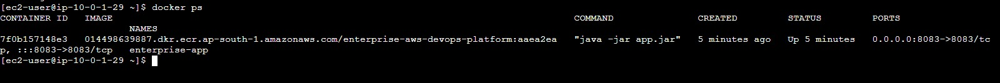
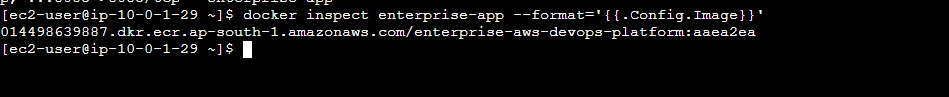
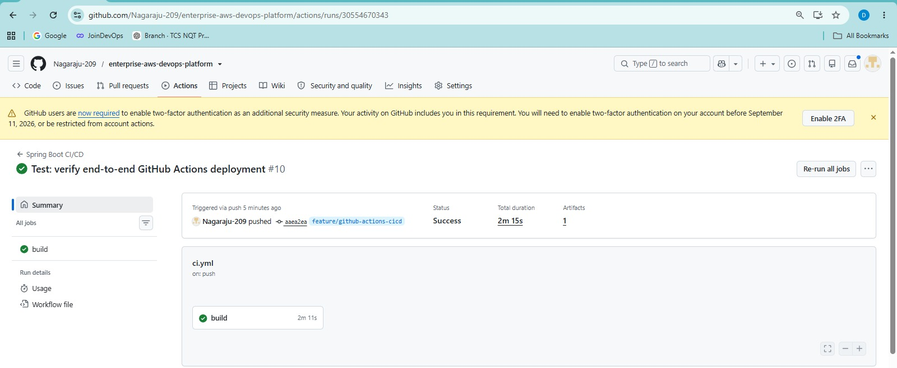
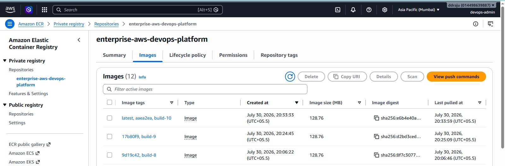

# Deployment

## Overview

The Enterprise AWS DevOps Platform uses an automated deployment path based on GitHub Actions, Amazon ECR, AWS Systems Manager, Docker, EC2, and an Application Load Balancer.

The final deployment flow is:

```text
Developer
    |
    v
GitHub
    |
    v
GitHub Actions
    |
    +--> Maven Build
    |
    +--> Docker Build
    |
    +--> Amazon ECR
    |
    v
AWS Systems Manager
    |
    v
EC2
    |
    v
Docker Container
    |
    v
Spring Boot :8083
    |
    v
Application Load Balancer
    |
    v
/health
    |
    v
Healthy
```

The deployment implementation was successfully validated and the AWS environment was intentionally destroyed after project completion.

---

# 1. Deployment Objectives

The deployment process is designed to:

- Build the Spring Boot application automatically.
- Package the application with Maven.
- Build a Docker image.
- Push the image to Amazon ECR.
- Deploy the image to EC2 using AWS Systems Manager.
- Run the application as a Docker container.
- Validate the application health.
- Validate the ALB target health.
- Integrate deployment with the monitoring architecture.

---

# 2. Deployment Components

The deployment pipeline uses:

```text
GitHub
GitHub Actions
Java 17
Maven
Docker
Amazon ECR
AWS Systems Manager
Amazon EC2
Application Load Balancer
CloudWatch
```

Responsibilities:

| Component | Responsibility |
|---|---|
| GitHub | Source control |
| GitHub Actions | CI/CD automation |
| Maven | Application build |
| Docker | Containerization |
| ECR | Container image registry |
| SSM | EC2 command execution |
| EC2 | Application runtime |
| ALB | Traffic routing and health checking |
| CloudWatch | Monitoring |
| SNS | Alert notification |

---

# 3. Deployment Repository

The project repository is:

```text
https://github.com/Nagaraju-209/enterprise-aws-devops-platform
```

The CI/CD workflow is located at:

```text
.github/workflows/ci.yml
```

Terraform infrastructure is located in the Terraform portion of the repository.

---

# 4. Branches

The project uses feature branches during development.

Important branches include:

```text
main
feature/github-actions-cicd
feature/application-load-balancer
feature/cloudwatch-monitoring
```

The completed CloudWatch monitoring and SSM deployment implementation was merged into `main`.

The `feature/cloudwatch-monitoring` branch is intentionally retained for project history.

---

# 5. Workflow Trigger

The final CI/CD workflow includes the relevant branches:

```yaml
on:
  push:
    branches:
      - main
      - feature/github-actions-cicd
      - feature/application-load-balancer
      - feature/cloudwatch-monitoring
```

Adding `main` was important because the completed project was merged into `main`.

Without the `main` trigger, a push to `main` would not automatically start the workflow.

---

# 6. Infrastructure Prerequisite

Deployment requires the AWS infrastructure to exist first.

The infrastructure is provisioned using Terraform.

General process:

```bash
terraform init
terraform validate
terraform plan
terraform apply
```

The expected infrastructure includes:

```text
VPC
Subnets
Internet Gateway
NAT Gateway
Route Tables
Security Groups
IAM
EC2
ECR
ALB
Target Group
CloudWatch
SNS
```

---

# 7. Infrastructure Outputs

During final infrastructure validation, Terraform produced outputs including:

```text
alb_dns_name
ec2_instance_id
ec2_private_ip
ec2_public_dns
ec2_public_ip
internet_gateway_id
nat_gateway_id
private_subnet_id
public_subnet_id
vpc_id
```

Historical validation values included:

```text
ALB:
enterprise-alb-348083509.ap-south-1.elb.amazonaws.com

EC2:
i-0b4f4c5039cc5dc82

Private IP:
10.0.1.252

Public IP:
13.232.110.8
```

These values belonged to the temporary project environment and are no longer active because the infrastructure was destroyed after completion.

---

# 8. Application Build

The application is a Spring Boot application using Java 17.

The CI workflow prepares the Java build environment and runs Maven.

Conceptually:

```text
Source Code
    |
    v
Java 17
    |
    v
Maven
    |
    v
Spring Boot JAR
```

The build stage ensures that the application can be packaged before the container image is created.

---

# 9. Maven Package

The application is packaged with Maven.

The equivalent build command is:

```bash
mvn clean package
```

The resulting JAR is used by the Docker image.

A deployment should not continue if the application build fails.

---

# 10. Docker Build

After the Maven package succeeds, Docker builds the application image.

```text
Spring Boot JAR
       |
       v
Dockerfile
       |
       v
Docker Image
```

The application container exposes:

```text
8083
```

The container name used by the deployment is:

```text
enterprise-app
```

---

# 11. Image Versioning

The deployment uses the Git commit SHA as an image version identifier.

Example:

```text
014498639887.dkr.ecr.ap-south-1.amazonaws.com/enterprise-aws-devops-platform:<commit-sha>
```

A historical deployment image used:

```text
d94dbbc
```

The exact image tag changes with each deployment.

This creates traceability:

```text
Git Commit
    |
    v
Docker Image Tag
    |
    v
ECR
    |
    v
EC2
```

---

# 12. Amazon ECR

Amazon Elastic Container Registry stores the Docker image.

The flow is:

```text
GitHub Actions
      |
      v
Docker Build
      |
      v
ECR Authentication
      |
      v
Docker Push
      |
      v
Amazon ECR
```

The EC2 deployment later pulls the same image.

---

# 13. ECR Authentication

The workflow authenticates Docker with ECR before pushing the image.

The AWS region used by the project is:

```text
ap-south-1
```

The ECR repository is:

```text
enterprise-aws-devops-platform
```

---

# 14. Deployment Through SSM

The final deployment mechanism is AWS Systems Manager.

```text
GitHub Actions
      |
      v
SSM SendCommand
      |
      v
EC2
      |
      v
Docker
```

This avoids using SSH as the normal CI/CD deployment mechanism.

The EC2 instance requires:

- SSM Agent
- IAM instance profile
- SSM connectivity

---

# 15. SSM Deployment Sequence

The deployment command performs the required container lifecycle operations.

Conceptually:

```text
Receive Deployment Command
          |
          v
Authenticate with ECR
          |
          v
Pull New Image
          |
          v
Stop Existing Container
          |
          v
Remove Existing Container
          |
          v
Start New Container
          |
          v
Validate Application
```

The actual command implementation in the workflow should remain the source of truth.

---

# 16. Container Deployment

The final application container is:

```text
enterprise-app
```

The container maps:

```text
8083 -> 8083
```

Conceptually:

```text
EC2
 |
 v
Docker
 |
 +-- enterprise-app
       |
       +-- Spring Boot
       +-- :8083
```

---

# 17. Application Health Check

The application exposes:

```text
/health
```

The expected response is:

```text
HTTP 200
```

Deployment validation should therefore follow:

```text
Container Started
       |
       v
Spring Boot Started
       |
       v
GET /health
       |
       v
HTTP 200
```

---

# 18. ALB Target Validation

The Application Load Balancer target group uses port:

```text
8083
```

and the health check:

```text
/health
```

The expected state is:

```text
healthy
```

The final validation produced:

```text
Port   State
8083   healthy
```

This confirms that the application is reachable through the ALB health-check path.

---

# 19. Deployment Validation Levels

The deployment is validated at several levels.

```text
Level 1
GitHub Actions
       |
       v
Workflow SUCCESS
```

```text
Level 2
EC2
       |
       v
Container RUNNING
```

```text
Level 3
Application
       |
       v
/health = HTTP 200
```

```text
Level 4
ALB
       |
       v
Target = healthy
```

```text
Level 5
CloudWatch
       |
       v
Alarms = OK
```

A successful SSM command alone is not sufficient to declare the deployment fully healthy.

---

# 20. End-to-End Deployment Flow

The complete flow is:

```text
                     Git Push
                        |
                        v
                     GitHub
                        |
                        v
                GitHub Actions
                        |
          +-------------+-------------+
          |                           |
          v                           v
      Maven Build               Docker Build
                                      |
                                      v
                                Amazon ECR
                                      |
                                      v
                                     SSM
                                      |
                                      v
                                    EC2
                                      |
                                      v
                                   Docker
                                      |
                                      v
                                Spring Boot
                                   :8083
                                      |
                                      v
                                    ALB
                                      |
                                      v
                                  /health
                                      |
                                      v
                                   Healthy
```

---

# 21. CI/CD Workflow Success

A successful GitHub Actions deployment should show:

```text
Checkout          -> Success
Java Setup        -> Success
Maven Build       -> Success
Docker Build      -> Success
ECR Push          -> Success
SSM Deployment    -> Success
Application Check -> Success
ALB Validation    -> Success
```

The final workflow was successfully validated.

---

# 22. SSM Command Monitoring

The SSM command can be inspected from the AWS CLI.

Example:

```bash
aws ssm get-command-invocation \
  --command-id <command-id> \
  --instance-id <instance-id> \
  --query '{Status:Status,Output:StandardOutputContent,Error:StandardErrorContent}' \
  --output json
```

Possible states include:

```text
Pending
InProgress
Success
Failed
Cancelled
TimedOut
```

---

# 23. SSM Successful Deployment

A successful SSM deployment should return:

```text
Status: Success
```

and the output should show the expected application/container state.

For example:

```text
enterprise-app
```

The application should then be validated through the ALB.

---

# 24. SSM Timeout / Connection Issues

The project encountered an SSM deployment incident.

The GitHub Actions workflow initially reported:

```text
SSM deployment timed out.
Process completed with exit code 1.
```

The corresponding SSM command remained:

```text
InProgress
```

Later investigation showed the EC2 SSM Agent was running, but the command had stale execution state.

---

# 25. SSM Stale Command Investigation

The SSM Agent logs showed:

```text
Found in-progress document
```

The agent attempted to resume the old command.

The logs then showed:

```text
process: 33207 not found, treat as exited
```

followed by:

```text
ipc messaging received timeout signal
```

The SSM command ultimately failed.

This demonstrated that:

```text
EC2 = Healthy
SSM Agent = Running
SSM Connectivity = Working
Old Command = Stale/Failed
```

---

# 26. SSM Agent Validation

The EC2 SSM Agent was checked with:

```bash
sudo systemctl status amazon-ssm-agent --no-pager -l
```

The expected state was:

```text
Active: active (running)
```

The agent logs were inspected with:

```bash
sudo journalctl -u amazon-ssm-agent --no-pager -n 100
```

and:

```bash
sudo tail -100 /var/log/amazon/ssm/amazon-ssm-agent.log
```

---

# 27. SSM Connectivity Validation

The agent successfully established the SSM message channel.

The logs showed a connection to:

```text
ssmmessages.ap-south-1.amazonaws.com
```

The endpoint was also tested from EC2.

A response such as:

```text
HTTP/1.1 400 Bad Request
```

from a direct endpoint request still demonstrated that the endpoint was reachable; the request itself was not a valid application-level SSM API request.

The important validation was the successful WebSocket/control-channel connection in the SSM Agent logs.

---

# 28. SSM Recovery

The stale command was cancelled and the EC2 instance was rebooted during troubleshooting.

The SSM Agent restarted successfully:

```text
amazon-ssm-agent.service
    |
    v
active (running)
```

The EC2 instance also successfully obtained its instance-profile credentials.

After the stale command state was cleared and the deployment was retried, the workflow succeeded.

---

# 29. Application Failure Test

The deployment and monitoring system was also tested by intentionally stopping the application container.

The SSM command produced:

```text
enterprise-app
Application container intentionally stopped for monitoring test
```

The ALB then detected the application as unhealthy.

This validated the monitoring path.

---

# 30. Recovery After Failure Test

After the application was restored:

```text
Container
    |
    v
Running
    |
    v
/health = 200
    |
    v
ALB = healthy
```

The relevant CloudWatch alarms returned to:

```text
OK
```

This demonstrated successful recovery.

---

# 31. ALB Health Validation

The ALB target health can be checked using:

```bash
aws elbv2 describe-target-health \
  --target-group-arn "<target-group-arn>" \
  --query 'TargetHealthDescriptions[].{Target:Target.Id,Port:Target.Port,State:TargetHealth.State,Reason:TargetHealth.Reason}' \
  --output table
```

Expected:

```text
Port   State
8083   healthy
```

---

# 32. Container Validation

On EC2:

```bash
docker ps
```

Expected output should include:

```text
enterprise-app
```

The application container should be:

```text
Up
```

and expose:

```text
0.0.0.0:8083->8083/tcp
```

---

# 33. Container Logs

If the application is unhealthy, inspect:

```bash
docker logs enterprise-app
```

Look for:

- Spring Boot startup errors
- Database connection errors
- Port binding errors
- Configuration errors
- Java exceptions
- Application initialization failures

---

# 34. Application Validation

The application should respond through the expected health endpoint.

The logical validation is:

```text
ALB
 |
 v
EC2 :8083
 |
 v
Spring Boot
 |
 v
/health
 |
 v
HTTP 200
```

The exact URL depends on the ALB DNS name generated by Terraform.

---

# 35. Monitoring Integration

Deployment is integrated with the CloudWatch monitoring layer.

```text
Deployment
    |
    v
EC2
    |
    v
ALB
    |
    v
Health Check
    |
    v
CloudWatch
    |
    v
Alarms
    |
    v
SNS
```

Important alarms include:

```text
enterprise-devops-ec2-high-cpu
enterprise-devops-alb-5xx-errors
enterprise-devops-alb-high-response-time
enterprise-devops-alb-no-healthy-targets
enterprise-devops-alb-unhealthy-targets
```

---

# 36. Deployment and Monitoring Relationship

A deployment should not be considered successful only because:

```text
GitHub Actions = Success
```

The final operational state should be:

```text
GitHub Actions = Success
       |
       v
SSM = Success
       |
       v
Container = Running
       |
       v
Application = Healthy
       |
       v
ALB = Healthy
       |
       v
CloudWatch = OK
```

---

# 37. Security During Deployment

The final deployment path does not require permanent inbound SSH.

```text
GitHub Actions
      |
      v
AWS Systems Manager
      |
      v
EC2
```

Temporary SSH access was used only for troubleshooting.

The temporary SSH source was restricted to:

```text
49.15.207.58/32
```

and was subsequently removed.

---

# 38. Deployment Permissions

The deployment requires AWS permissions for:

```text
ECR
SSM
EC2-related operations
```

The project uses IAM-based permissions.

The exact permissions are defined by the repository's AWS/IAM configuration.

For production, GitHub Actions should preferably use short-lived AWS credentials through GitHub OIDC rather than long-lived static access keys.

---

# 39. Deployment Rollback Concept

The image-tagging strategy provides a foundation for rollback.

Because images are tagged by Git commit SHA:

```text
Image A -> commit A
Image B -> commit B
Image C -> commit C
```

a previous image can be identified and redeployed if a newer version causes a problem.

Conceptually:

```text
Current
   |
   v
Image C
   |
   X
Failure
   |
   v
Redeploy
   |
   v
Image B
```

The project did not implement a fully automated rollback mechanism, but the versioned-image design supports manual rollback.

---

# 40. Deployment Failure Decision Tree

When a deployment fails:

```text
GitHub Actions Failed?
        |
       YES
        |
        v
Identify Failed Stage
        |
        +-- Maven
        |
        +-- Docker
        |
        +-- ECR
        |
        +-- SSM
        |
        +-- Health Check
```

If GitHub Actions succeeds but the application is unhealthy:

```text
Workflow Success
      |
      v
Check SSM
      |
      v
Check Docker
      |
      v
Check Application
      |
      v
Check ALB
      |
      v
Check CloudWatch
```

---

# 41. Maven Failure

If Maven fails:

```text
Maven
  |
  X
Build Failure
```

Check:

```bash
java -version
mvn -version
mvn clean package
```

Investigate:

- Java version
- Maven version
- Compilation errors
- Test failures
- Dependency problems
- Application configuration

---

# 42. Docker Build Failure

If Docker fails:

Check:

```text
Dockerfile
Build Context
JAR Location
Base Image
Application Port
```

Local validation:

```bash
docker build -t enterprise-aws-devops-platform:test .
```

Then:

```bash
docker run --rm -p 8083:8083 \
  enterprise-aws-devops-platform:test
```

---

# 43. ECR Push Failure

If ECR push fails, check:

```text
AWS Credentials
AWS Region
ECR Repository
Docker Authentication
IAM Permissions
Image Tag
```

The intended repository is:

```text
enterprise-aws-devops-platform
```

in:

```text
ap-south-1
```

---

# 44. SSM Deployment Failure

If SSM fails:

Check:

```bash
aws ssm get-command-invocation \
  --command-id <command-id> \
  --instance-id <instance-id> \
  --output json
```

Then inspect the EC2 agent:

```bash
sudo systemctl status amazon-ssm-agent --no-pager -l
```

and:

```bash
sudo journalctl -u amazon-ssm-agent --no-pager -n 100
```

Also check:

```bash
docker ps
docker logs enterprise-app
```

---

# 45. ALB Health Failure

If the SSM deployment succeeds but ALB remains unhealthy:

```text
SSM = Success
      |
      v
Container
      |
      v
Application
      |
      v
ALB Target
```

Check each layer independently.

Verify:

```bash
docker ps
```

Then:

```bash
docker logs enterprise-app
```

Then inspect ALB target health.

Common areas to check:

- Container port
- Application port
- Health-check path
- Security groups
- Application startup
- Target registration

---

# 46. Deployment Validation Checklist

After every deployment:

```text
[ ] GitHub Actions succeeded
[ ] Maven build succeeded
[ ] Docker image built
[ ] Image pushed to ECR
[ ] SSM command succeeded
[ ] EC2 container is running
[ ] enterprise-app exists
[ ] Port 8083 is exposed
[ ] /health returns HTTP 200
[ ] ALB target is healthy
[ ] CloudWatch alarms are OK
```

---

# 47. Manual Deployment Investigation Commands

## EC2 container

```bash
docker ps
```


> **Evidence — Updated application container**
>
> 

> **Evidence — Container inspection**
>
> 

## Application logs

```bash
docker logs enterprise-app
```

## SSM Agent

```bash
sudo systemctl status amazon-ssm-agent --no-pager -l
```

## SSM logs

```bash
sudo journalctl -u amazon-ssm-agent --no-pager -n 100
```

## SSM command

```bash
aws ssm get-command-invocation \
  --command-id <command-id> \
  --instance-id <instance-id> \
  --output json
```

## ALB target

```bash
aws elbv2 describe-target-health \
  --target-group-arn "<target-group-arn>"
```

---

# 48. Deployment Sequence for Recreated Infrastructure

When the AWS infrastructure is recreated:

```text
1. Terraform Apply
       |
       v
2. Verify EC2
       |
       v
3. Verify SSM
       |
       v
4. Verify ECR
       |
       v
5. Push Git Commit
       |
       v
6. GitHub Actions Starts
       |
       v
7. Maven Build
       |
       v
8. Docker Build
       |
       v
9. ECR Push
       |
       v
10. SSM Deployment
       |
       v
11. Container Starts
       |
       v
12. Application Health
       |
       v
13. ALB Health
       |
       v
14. CloudWatch Validation
```

---

# 49. Deployment from Main

The completed project supports deployment from `main`.

The expected flow is:

```text
feature branches
      |
      v
Validation
      |
      v
Merge
      |
      v
main
      |
      v
GitHub Actions
      |
      v
Production-style deployment
```

The CloudWatch monitoring branch remains available for history and does not need to be deleted.

---

# 50. Deployment and Git History

Important CI/CD-related commits include:

```text
15b3289 CI/CD: deploy to EC2 using SSM
d94dbbc CI/CD: trigger monitoring branch deployment
```

The final Git history also contains the completed monitoring and deployment integration.

This provides traceability between implementation changes and deployment behavior.

---

# 51. Deployment Security Checklist

Before deployment:

```text
[ ] AWS credentials are securely configured
[ ] IAM permissions are available
[ ] ECR repository exists
[ ] EC2 is running
[ ] SSM Agent is active
[ ] EC2 is managed by SSM
[ ] Required network connectivity exists
[ ] Security groups are correct
[ ] No unnecessary SSH access is enabled
```

---

# 52. Post-Deployment Security Checklist

After deployment:

```text
[ ] Container is running
[ ] Application is healthy
[ ] ALB target is healthy
[ ] Temporary SSH access is removed
[ ] CloudWatch alarms are OK
[ ] SNS subscription is confirmed
[ ] Correct image tag is running
```

---

# 53. Final Successful Deployment

The final implementation achieved:

```text
GitHub Actions
      |
      v
Maven
      |
      v
Docker
      |
      v
Amazon ECR
      |
      v
AWS SSM
      |
      v
EC2
      |
      v
enterprise-app
      |
      v
Spring Boot :8083
      |
      v
ALB
      |
      v
healthy
```

The workflow succeeded and the ALB target was healthy.

---

# 54. Final Deployment and Monitoring Test

The project also validated the complete operational lifecycle.

Failure:

```text
Application Container
       |
       X
Stopped
       |
       v
ALB Target
       |
       v
Unhealthy
       |
       v
CloudWatch
       |
       v
ALARM
       |
       v
SNS
```

Recovery:

```text
Application Container
       |
       v
Started
       |
       v
/health = 200
       |
       v
ALB = healthy
       |
       v
CloudWatch = OK
```

This demonstrates that deployment and monitoring work together.

---

# 55. Infrastructure Teardown

After the project was completed and documented, the AWS infrastructure was intentionally destroyed.

The teardown process was:

```bash
terraform plan -destroy
```

followed by:

```bash
terraform destroy
```

The final Terraform state showed no remaining managed resources.

The deployment configuration remains preserved in GitHub and can be recreated when required.

---

# 56. Recreating the Complete Deployment

The complete project can be recreated using:

```text
Terraform
   |
   v
AWS Infrastructure
   |
   v
GitHub Actions
   |
   v
ECR
   |
   v
SSM
   |
   v
EC2
   |
   v
ALB
   |
   v
CloudWatch
```

This is one of the main benefits of combining Infrastructure as Code with CI/CD.

---

# 57. Production Improvements

The deployment architecture can be improved further.

## GitHub OIDC

Replace long-lived AWS credentials with:

```text
GitHub Actions
      |
      v
OIDC
      |
      v
IAM Role
      |
      v
AWS
```

## HTTPS

Add:

```text
ACM
 |
 v
HTTPS ALB
```

## Blue/Green Deployment

Use:

```text
ALB
 |
 +-- Blue
 |
 +-- Green
```

and switch traffic after validation.


> **Evidence — Successful deployment workflow**
>
> 

> **Evidence — ECR image after deployment**
>
> 

## Automated Rollback

If:

```text
Deployment
   |
   v
Health Check Failure
```

automatically redeploy the previous known-good image.

## Auto Scaling

Use:

```text
ALB
 |
 v
Auto Scaling Group
 |
 +-- EC2
 +-- EC2
```

for higher availability.

---

# 58. Final Deployment Summary

The Enterprise AWS DevOps Platform implements a complete deployment lifecycle:

```text
SOURCE
  |
  v
BUILD
  |
  v
TEST
  |
  v
CONTAINERIZE
  |
  v
PUBLISH
  |
  v
DEPLOY
  |
  v
HEALTH CHECK
  |
  v
LOAD BALANCE
  |
  v
MONITOR
  |
  v
ALERT
  |
  v
RECOVER
```

The final deployment mechanism uses:

```text
GitHub Actions
        +
Amazon ECR
        +
AWS Systems Manager
        +
Amazon EC2
        +
Docker
        +
Application Load Balancer
```

The implementation was successfully validated, including deployment success, application health, ALB health, monitoring behavior, and recovery testing.

---

# 59. Final Deployment State

At project completion:

```text
CI/CD Workflow       -> Preserved
GitHub Repository    -> Preserved
Docker Configuration -> Preserved
Terraform            -> Preserved
SSM Deployment       -> Validated
ALB Health           -> Validated
CloudWatch           -> Validated
SNS                  -> Validated
AWS Infrastructure   -> Destroyed
Terraform State      -> Empty
```

The deployment environment is therefore documented and reproducible without leaving the temporary AWS infrastructure running.

---

## Visual Evidence

Screenshots are embedded next to the relevant implementation and validation sections above. The complete screenshot library is available in the repository [`screenshots/`](../screenshots/).
