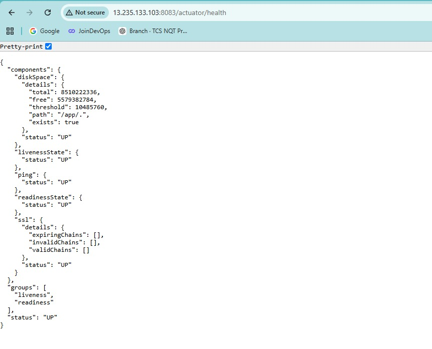
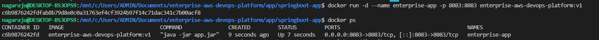
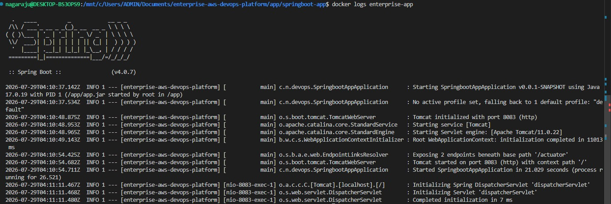

# Troubleshooting

## Overview

This document records the major troubleshooting incidents encountered while building and validating the **Enterprise AWS DevOps Platform**.

The goal is to preserve the actual problems, symptoms, investigation commands, root causes, fixes, and validation steps used during the project.

The main troubleshooting areas were:

- Terraform state and infrastructure changes
- GitHub Actions CI/CD
- Docker and EC2 deployment
- AWS Systems Manager
- SSM `ConnectionLost` / `InProgress` states
- CloudWatch Agent configuration
- Application Load Balancer health
- CloudWatch alarms
- SNS email subscriptions
- Security-group rule cleanup
- Final infrastructure teardown

---

# 1. Troubleshooting Philosophy

The project used a layered troubleshooting approach.

```text
GitHub Actions
      |
      v
ECR
      |
      v
SSM
      |
      v
EC2
      |
      v
Docker
      |
      v
Spring Boot
      |
      v
ALB
      |
      v
CloudWatch
      |
      v
SNS
```

When a problem occurred, the affected layer was isolated before changing infrastructure.

The general process was:

```text
Observe
   |
   v
Identify Layer
   |
   v
Collect Evidence
   |
   v
Test Hypothesis
   |
   v
Apply Minimal Fix
   |
   v
Validate
   |
   v
Document
```

---

# 2. Terraform Plan Showing Unexpected Destruction

## Symptom

At one point Terraform reported:

```text
Plan: 0 to add, 0 to change, 40 to destroy.
```

This indicated that Terraform believed the current AWS infrastructure should be removed.

## Investigation

The first step was to inspect Terraform state:

```bash
terraform state list
```

The state contained resources such as:

```text
data.aws_ami.amazon_linux
data.aws_iam_policy_document.ec2_assume_role
aws_cloudwatch_dashboard.enterprise
aws_cloudwatch_log_group.application
aws_cloudwatch_metric_alarm.alb_5xx_errors
aws_cloudwatch_metric_alarm.alb_high_response_time
aws_cloudwatch_metric_alarm.alb_no_healthy_targets
...
```

## Resolution

The infrastructure configuration/state relationship was reviewed before making destructive changes.

Later, after the project was intentionally completed, Terraform was used to destroy the infrastructure.

The important lesson is:

```text
terraform plan
      |
      v
Unexpected destroy?
      |
      v
STOP
      |
      v
Inspect state/configuration
```

Never blindly apply a plan containing large unexpected destruction.

---

# 3. Terraform Clean State

After the final infrastructure teardown, Terraform reported that no infrastructure remained under management.

The final state was checked with:

```bash
terraform state list
```

The result showed no remaining managed resources.

This confirmed:

```text
AWS Infrastructure -> Destroyed
Terraform State    -> Empty
```

This was intentional because the AWS environment was a temporary project environment.

---

# 4. Terraform No-Changes Validation

During validation Terraform also produced:

```text
No changes.
Your infrastructure matches the configuration.
```

This was a useful drift check.

It confirmed that Terraform did not detect differences between the declared configuration and the deployed resources at that stage.

The distinction is:

```text
No changes
    =
Configuration matches deployed infrastructure
```

whereas:

```text
terraform destroy
    =
Intentionally remove infrastructure
```

---

# 5. GitHub Actions Workflow Trigger Issue

## Symptom

The CloudWatch monitoring branch had its own workflow trigger.

The workflow initially contained:

```yaml
on:
  push:
    branches:
      - feature/github-actions-cicd
      - feature/application-load-balancer
      - feature/cloudwatch-monitoring
```

After the CloudWatch monitoring work was merged into `main`, pushes to `main` would not trigger the workflow.

## Resolution

The `main` branch was added:

```yaml
on:
  push:
    branches:
      - main
      - feature/github-actions-cicd
      - feature/application-load-balancer
      - feature/cloudwatch-monitoring
```

The change was verified with:

```bash
git diff -- .github/workflows/ci.yml
```

The important difference was:

```diff
 on:
   push:
     branches:
+      - main
       - feature/github-actions-cicd
       - feature/application-load-balancer
       - feature/cloudwatch-monitoring
```

## Lesson

When feature work is merged into `main`, the CI/CD workflow must also be configured to execute for `main` if the project expects main-branch deployments.

---

# 6. CloudWatch Agent Configuration Error

## Symptom

An SSM deployment command failed with:

```text
ls: cannot access '/opt/aws/amazon-cloudwatch-agent/etc/amazon-cloudwatch-agent.json':
No such file or directory

failed to run commands: exit status 2
```

The command output also showed the application container was running:

```text
CONTAINER ID   IMAGE
691f7cd2fb73   014498639887.dkr.ecr.ap-south-1.amazonaws.com/enterprise-aws-devops-platform:d94dbbc
```

and:

```text
enterprise-app
```

was up on port `8083`.

## Diagnosis

The failure was not caused by the application container.

The container was already running.

The failing operation was trying to access a CloudWatch Agent configuration file that did not exist at:

```text
/opt/aws/amazon-cloudwatch-agent/etc/amazon-cloudwatch-agent.json
```

## Lesson

A deployment command can fail even when the application itself is healthy.

Separate:

```text
Application state
```

from:

```text
Deployment-script state
```

A successful container start does not automatically mean the entire SSM script succeeded.

---

# 7. SNS Email Subscription Problem

## Symptom

Terraform planned:

```text
# aws_sns_topic_subscription.monitoring_email will be created

Plan: 1 to add, 0 to change, 0 to destroy
```

The email did not appear initially.

The issue was traced to the subscription lifecycle.

The subscription had previously been confirmed and then the unsubscribe link was clicked.

## Resolution

Terraform recreated the email subscription.

A new confirmation email was then received.

The subscription was confirmed successfully with:

```text
# Subscription confirmed!

You have successfully subscribed.
```

The resulting subscription ARN was:

```text
arn:aws:sns:ap-south-1:014498639887:enterprise-devops-monitoring-alerts:f622fa39-0fe9-4edc-91ca-c9f20321bbd4
```

## Lesson

SNS email subscriptions require confirmation.

If an existing email subscription has been unsubscribed:

```text
Unsubscribed
     |
     v
Terraform recreates subscription
     |
     v
Confirmation email
     |
     v
User confirms
     |
     v
Subscription active
```

Terraform can create the subscription, but the email endpoint still needs to complete the confirmation process.

---

# 8. ALB Target Health Validation

## Symptom

During a normal deployment, Terraform reported:

```text
No changes. Your infrastructure matches the configuration.
```

The ALB target health showed:

```text
Port   State     Target
8083   healthy   i-0b4f4c5039cc5dc82
```

This confirmed the application was healthy.

## Validation

The target health was checked through:

```bash
aws elbv2 describe-target-health \
  --target-group-arn "<target-group-arn>"
```

The expected result was:

```text
8083   healthy
```

## Lesson

Always validate both:

```text
Deployment success
```

and:

```text
ALB target health
```

A successful CI/CD workflow alone is not enough.

---

# 9. Intentional Application Failure Test

## Purpose

The monitoring system was deliberately tested by stopping the application container.

The SSM command returned:

```text
Status: Success
```

with:

```text
enterprise-app
Application container intentionally stopped for monitoring test
```

This was an intentional test rather than an accidental outage.

## Expected Behavior

```text
Container stopped
      |
      v
Application unavailable
      |
      v
ALB health check fails
      |
      v
Target becomes unhealthy
      |
      v
CloudWatch alarms
      |
      v
SNS
      |
      v
Email
```

---

# 10. ALB Alarms Entered ALARM

During the intentional failure test, the following alarms entered `ALARM`:

```text
enterprise-devops-alb-no-healthy-targets
enterprise-devops-alb-unhealthy-targets
```

This was expected behavior.

It proved that:

```text
Application Failure
      |
      v
ALB Target Health
      |
      v
CloudWatch Alarm
```

was working correctly.

---

# 11. Recovery After ALB Failure Test

After the application was restored, the target returned to:

```text
healthy
```

The alarms returned to:

```text
OK
```

The complete recovery path was:

```text
Container Restored
      |
      v
Spring Boot Running
      |
      v
/health -> HTTP 200
      |
      v
ALB Target -> healthy
      |
      v
CloudWatch -> OK
```

## Lesson

Monitoring should be tested in both directions:

```text
Healthy -> Failure
```

and:

```text
Failure -> Recovery
```

Testing only the healthy state does not prove that alerting works.

---

# 12. SSM Deployment Timeout

## Symptom

GitHub Actions reported:

```text
SSM deployment timed out.
Error: Process completed with exit code 1.
```

The SSM command was checked using:

```bash
aws ssm get-command-invocation \
  --command-id <command-id> \
  --instance-id i-0b4f4c5039cc5dc82 \
  --query '{Status:Status,Output:StandardOutputContent,Error:StandardErrorContent}' \
  --output json
```

The command initially returned:

```text
Status: InProgress
```

with no output.

## Initial Interpretation

The GitHub Actions timeout did not necessarily mean the EC2 instance was unavailable.

The actual SSM command state had to be checked separately.

This distinction was important:

```text
GitHub Actions timeout
        !=
EC2 failure
        !=
SSM command failure
```

---

# 13. SSM Command Remaining InProgress

The command continued to show:

```text
Status: InProgress
```

The SSM plugin also showed:

```text
PluginStatus: InProgress
ResponseCode: -1
Output: ""
Error: null
```

The command was therefore not completing normally.

The investigation moved to the EC2 instance.

---

# 14. SSM Agent Status

The EC2 SSM Agent was checked with:

```bash
sudo systemctl status amazon-ssm-agent --no-pager -l
```

The result showed:

```text
Active: active (running)
```

The process tree included:

```text
/usr/bin/amazon-ssm-agent
/usr/bin/ssm-agent-worker
```

This confirmed that the SSM Agent itself was running.

---

# 15. SSM Agent Logs

The logs were inspected using:

```bash
sudo journalctl -u amazon-ssm-agent --no-pager -n 100
```

and:

```bash
sudo tail -100 /var/log/amazon/ssm/amazon-ssm-agent.log
```

The logs showed:

```text
Agent will take identity from EC2
```

and:

```text
EC2RoleProvider Successfully connected with instance profile role credentials
```

This confirmed that the EC2 instance could obtain its IAM role credentials.

---

# 16. SSM ConnectionLost Investigation

The SSM command had also appeared as:

```text
ConnectionLost
```

The EC2 instance was rebooted after cancelling the stuck command.

Even after the reboot, the command could continue to show the stale state.

This demonstrated that rebooting EC2 does not necessarily remove an already-recorded SSM command state immediately.

---

# 17. SSM Stale Command After Reboot

After the reboot, the SSM Agent log contained:

```text
Found in-progress document - 82afa42e-48b4-420c-b2be-5ce3846c060d
```

The agent attempted to resume processing the command.

The log then showed:

```text
process: 33207 not found, treat as exited
```

This indicated that the original command process no longer existed.

The SSM Agent continued processing the old document state.

---

# 18. SSM WebSocket Connection Validation

The logs showed:

```text
Opening websocket connection to:
wss://ssmmessages.ap-south-1.amazonaws.com/v1/control-channel/i-0b4f4c5039cc5dc82
```

followed by:

```text
Successfully opened websocket connection to: 13.200.95.40:443
```

and:

```text
Set up control channel successfully
```

This confirmed that the SSM message channel was functioning.

A direct connectivity check was also performed:

```bash
curl -I https://ssmmessages.ap-south-1.amazonaws.com
```

The response was:

```text
HTTP/1.1 400 Bad Request
```

Although this is not an application-level success response, it demonstrated that the endpoint was reachable over HTTPS.

## Lesson

A `400 Bad Request` from a raw HTTP request to the SSM message endpoint does not by itself mean the SSM Agent is broken.

The agent's own successful WebSocket connection was the stronger validation.

---

# 19. Root Cause of the SSM Stuck Command

The SSM Agent log eventually showed:

```text
ipc messaging received timedout signal!
```

followed by:

```text
messaging worker encountered error:
ipc messaging received timeout signal
```

and:

```text
document state during messaging worker error: InProgress
```

The agent then reported:

```text
document failed half way, sending fail message...
```

and finally:

```text
documentStatus: Failed
```

The runtime output was:

```text
document process failed unexpectedly:
ipc messaging received timeout signal
```

## Interpretation

The issue was a stale/in-progress SSM command execution after the original process was no longer present.

It was not simply:

```text
EC2 down
```

or:

```text
SSM Agent stopped
```

or:

```text
No network
```

The SSM Agent was healthy and connected to AWS, but the old command execution could not resume normally.

---

# 20. SSM Recovery

The stuck command was cancelled/recovered and the EC2 instance was rebooted during investigation.

After the stale execution was cleared, a new SSM deployment was executed.

The new deployment completed successfully.

The final workflow succeeded and the ALB target became:

```text
healthy
```

This validated the complete deployment path again.

---

# 21. SSM Troubleshooting Checklist

When an SSM command becomes stuck:

### Step 1 — Check command state

```bash
aws ssm get-command-invocation \
  --command-id <command-id> \
  --instance-id <instance-id> \
  --query '{Status:Status,Output:StandardOutputContent,Error:StandardErrorContent}' \
  --output json
```

### Step 2 — Check EC2

Verify the instance is running.

### Step 3 — Check SSM Agent

```bash
sudo systemctl status amazon-ssm-agent --no-pager -l
```


> **Evidence — Successful deployment workflow**
>
> 

> **Evidence — Application health validation**
>
> 

### Step 4 — Check logs

```bash
sudo journalctl -u amazon-ssm-agent --no-pager -n 100
```

### Step 5 — Check detailed agent log

```bash
sudo tail -100 /var/log/amazon/ssm/amazon-ssm-agent.log
```

### Step 6 — Check IAM credentials

Look for:

```text
Successfully connected with instance profile role credentials
```

### Step 7 — Check SSM connectivity

Verify that the agent can establish its control channel.

### Step 8 — Inspect stale command state

Look for:

```text
Found in-progress document
```

and:

```text
process not found
```

### Step 9 — Cancel/recover stale execution

Do not continue waiting indefinitely on a known stale command.

### Step 10 — Run a fresh deployment

After the stale state is resolved, run a new SSM deployment.

---

# 22. GitHub Actions Timeout vs SSM State

A recurring lesson from the incident is that GitHub Actions and SSM have separate execution states.

```text
GitHub Actions
     |
     | starts
     v
SSM Command
     |
     +-- Pending
     |
     +-- InProgress
     |
     +-- Success
     |
     +-- Failed
     |
     +-- ConnectionLost
```

GitHub Actions can time out while the underlying SSM command remains:

```text
InProgress
```

Therefore, always inspect the AWS-side command state before assuming the deployment completely failed.

---

# 23. Docker Deployment Troubleshooting

The application container was validated using:

```bash
docker ps
```

The expected container was:

```text
enterprise-app
```

and the application port was:

```text
8083
```

A typical healthy state was:

```text
enterprise-app
Up
0.0.0.0:8083->8083/tcp
```

If the container is missing:

```bash
docker ps -a
```

should be used to identify stopped containers.

Then inspect:

```bash
docker logs enterprise-app
```

---

# 24. Application Health Troubleshooting

The application health path is:

```text
ALB
 |
 v
EC2 :8083
 |
 v
Spring Boot
 |
 v
/health
```

If the ALB reports `unhealthy`, check:

```text
1. Is Docker running?
2. Is enterprise-app running?
3. Is port 8083 listening?
4. Is Spring Boot running?
5. Does /health return HTTP 200?
6. Is the target group configured for port 8083?
7. Is the health-check path correct?
8. Do security groups allow the ALB-to-EC2 traffic?
```

---

# 25. ALB Unhealthy Troubleshooting

If the target is:

```text
unhealthy
```

use:

```bash
aws elbv2 describe-target-health \
  --target-group-arn "<target-group-arn>"
```

Check:

```text
State
Reason
Description
Port
Target ID
```

Then inspect the EC2 application.

The troubleshooting chain is:

```text
ALB Target
    |
    v
Health Check
    |
    v
EC2 :8083
    |
    v
Docker
    |
    v
Spring Boot
```

---

# 26. CloudWatch Alarm Troubleshooting

If an alarm enters:

```text
ALARM
```

first identify the affected layer.

### EC2 CPU

Check:

```text
EC2 CPU utilization
```

### ALB 5xx

Check:

```text
ALB errors
Target health
Application logs
```


> **Evidence — Unhealthy ALB target**
>
> 

> **Evidence — Recovered ALB target**
>
> 

### High response time

Check:

```text
ALB latency
EC2 CPU
EC2 memory
Application logs
```

### No healthy targets

Check:

```text
Target group
EC2
Docker
Application
/health
```

### Unhealthy targets

Check:

```text
Health-check path
Health-check port
Application
Container
Security groups
```

---

# 27. CloudWatch Agent File Troubleshooting

When a deployment script references:

```text
/opt/aws/amazon-cloudwatch-agent/etc/amazon-cloudwatch-agent.json
```

first verify that the file exists:

```bash
ls -l /opt/aws/amazon-cloudwatch-agent/etc/
```

If the file does not exist, determine whether:

- The CloudWatch Agent is installed.
- The configuration was created.
- The configuration path is correct.
- The deployment script is running the configuration step before attempting to read it.

Do not assume the application container caused the error if the error clearly references the CloudWatch Agent filesystem.

---

# 28. SNS Troubleshooting

If a CloudWatch alarm enters `ALARM` but no email is received:

### Check subscription

Verify the SNS subscription status.

### Check confirmation

An email subscription must be confirmed.

### Check unsubscribe history

If the address was previously unsubscribed, Terraform may need to recreate the subscription.

### Check topic

Confirm the alarm action points to the correct SNS topic.

The intended flow is:

```text
Alarm
  |
  v
SNS Topic
  |
  v
Confirmed Email Subscription
  |
  v
Email
```

---

# 29. SNS Confirmation Troubleshooting

If Terraform shows:

```text
Plan: 1 to add, 0 to change, 0 to destroy
```

for the email subscription, this means Terraform intends to create the subscription.

It does not mean the email endpoint has already confirmed it.

Expected sequence:

```text
terraform apply
       |
       v
SNS subscription created
       |
       v
Confirmation email
       |
       v
Click Confirm
       |
       v
Subscription confirmed
```

If the user previously clicked unsubscribe, a new subscription/confirmation cycle may be required.

---

# 30. Security-Group Rule Troubleshooting

An attempt was made to revoke an SSH rule using:

```bash
aws ec2 revoke-security-group-ingress \
  --group-id sg-03aacefd0169c3987 \
  --security-group-rule-id 49.15.207.58
```

AWS returned:

```text
InvalidSecurityGroupRuleId.Malformed
```

The same happened when:

```text
49.15.207.58/32
```

was supplied.

## Root Cause

The value:

```text
49.15.207.58/32
```

is an IP/CIDR source, not an AWS security-group rule ID.

An AWS rule ID has a different format.

## Correct Investigation

First inspect the security-group rules:

```bash
aws ec2 describe-security-group-rules \
  --filters Name=group-id,Values=sg-03aacefd0169c3987
```

Find the actual rule ID associated with the temporary SSH rule.

Then revoke using the actual rule ID:

```bash
aws ec2 revoke-security-group-ingress \
  --group-id sg-03aacefd0169c3987 \
  --security-group-rule-id <actual-rule-id>
```

Alternatively, revoke using the matching rule parameters when appropriate.

## Lesson

Do not confuse:

```text
Source CIDR
```

with:

```text
Security Group Rule ID
```

---

# 31. Temporary SSH Cleanup Validation

After removing temporary SSH access, verify the security group again:

```bash
aws ec2 describe-security-group-rules \
  --filters Name=group-id,Values=<security-group-id>
```

Confirm that the temporary `/32` rule is no longer present.

The final intended model is:

```text
Temporary SSH
      |
      v
Removed
```

while:

```text
ALB
 |
 v
EC2 :8083
```

remains available.

---

# 32. Git Branch Troubleshooting

The project intentionally retained:

```text
feature/cloudwatch-monitoring
```

after merging the work into `main`.

The branch was not deleted because the workflow still referenced it:

```yaml
branches:
  - main
  - feature/github-actions-cicd
  - feature/application-load-balancer
  - feature/cloudwatch-monitoring
```

This preserves the branch for project history and allows its workflow trigger to remain valid.

---

# 33. Merge Validation

The CloudWatch monitoring work was merged into `main`.

The final project history included commits such as:

```text
d94dbbc CI/CD: trigger monitoring branch deployment
15b3289 CI/CD: deploy to EC2 using SSM
ce82102 Monitoring: add dashboard and security hardening
09599b0 Monitoring: add alarms and verify
cd39330 Monitoring: add ec2 cpu cloudwatch alarm
```

The branch was intentionally retained.

---

# 34. Git Working Tree Validation

Before continuing with infrastructure or documentation work, Git status was checked:

```bash
git status
```

The result was:

```text
On branch feature/cloudwatch-monitoring
nothing to commit, working tree clean
```

The recent history was inspected with:

```bash
git log --oneline -5
```

This is a useful pre-change check:

```text
git status
      |
      v
Working tree clean?
      |
      v
Proceed safely
```

---

# 35. CI/CD Failure Troubleshooting

If GitHub Actions reports:

```text
Process completed with exit code 1
```

do not immediately assume the application failed.

Check:

```text
1. Which workflow step failed?
2. Did Maven succeed?
3. Did Docker build succeed?
4. Did ECR push succeed?
5. Did SSM command start?
6. What is the SSM command state?
7. Is the EC2 container running?
8. Is the ALB target healthy?
```

The project demonstrated why the SSM-side status must be checked independently.

---

# 36. End-to-End Deployment Troubleshooting

The complete diagnostic path is:

```text
GitHub Actions
      |
      v
Maven
      |
      v
Docker Build
      |
      v
ECR Push
      |
      v
SSM Command
      |
      v
EC2
      |
      v
Docker Container
      |
      v
Spring Boot
      |
      v
/health
      |
      v
ALB Target
      |
      v
CloudWatch
```

Find the first failed layer.

For example:

```text
ECR Push Failed
```

should not lead to debugging ALB health first.

Likewise:

```text
ALB Unhealthy
```

should not automatically lead to changing Terraform networking.

---

# 37. Recommended Diagnostic Commands

## Git

```bash
git status
git log --oneline -5
git diff
```

## Terraform

```bash
terraform plan
terraform state list
terraform show
```

## EC2

```bash
aws ec2 describe-instances
```

## Docker

```bash
docker ps
docker ps -a
docker logs enterprise-app
```


> **Evidence — Docker container state**
>
> 

> **Evidence — Docker logs**
>
> 

## SSM

```bash
aws ssm get-command-invocation \
  --command-id <command-id> \
  --instance-id <instance-id>
```

## SSM Agent

```bash
sudo systemctl status amazon-ssm-agent --no-pager -l
```

## SSM logs

```bash
sudo journalctl -u amazon-ssm-agent --no-pager -n 100
```

## ALB

```bash
aws elbv2 describe-target-health \
  --target-group-arn "<target-group-arn>"
```

## Security groups

```bash
aws ec2 describe-security-group-rules \
  --filters Name=group-id,Values=<security-group-id>
```

---

# 38. Troubleshooting Decision Tree

```text
Workflow Failed?
      |
      +-- No --> Check ALB Health
      |
      +-- Yes
           |
           v
      Identify Failed Step
           |
     +-----+-----+-----+
     |           |     |
   Build       ECR    SSM
     |           |     |
     v           v     v
  Maven      Auth/Push  Command
                       |
                       v
                  Check EC2
                       |
                       v
                  Check Agent
                       |
                       v
                  Check Logs
```

If SSM succeeds:

```text
Check Container
      |
      v
Check /health
      |
      v
Check ALB Target
```

---

# 39. Important Lessons Learned

## Lesson 1 — Read the actual error

If an error says:

```text
No such file or directory
```

investigate the missing file before changing unrelated infrastructure.

---

## Lesson 2 — Separate control-plane state from application state

An SSM command can be:

```text
InProgress
```

while the EC2 instance is healthy.

An EC2 instance can be healthy while the application container is stopped.

---

## Lesson 3 — Validate at every layer

```text
Workflow
   |
   v
SSM
   |
   v
EC2
   |
   v
Docker
   |
   v
Application
   |
   v
ALB
   |
   v
CloudWatch
```

---

## Lesson 4 — Test failures intentionally

The intentional container-stop test proved that the monitoring system actually detected an outage.

---

## Lesson 5 — Do not confuse IP addresses with AWS resource IDs

An IP/CIDR is not a security-group rule ID.

---

## Lesson 6 — Terraform plan must be reviewed

A plan showing:

```text
40 to destroy
```

should always be investigated before applying.

---

## Lesson 7 — Rebooting does not automatically clear every cloud-side execution state

An EC2 reboot restarted the SSM Agent, but the agent found the previous in-progress document.

The stale execution had to be handled separately.

---

## Lesson 8 — SNS email subscriptions require confirmation

Terraform creating a subscription is not equivalent to the email endpoint being confirmed.

---

# 40. Final Troubleshooting Workflow

For future incidents, use:

```text
                 INCIDENT
                     |
                     v
               Check Symptoms
                     |
                     v
               Identify Layer
                     |
       +-------------+-------------+
       |             |             |
       v             v             v
      AWS           App           CI/CD
       |             |             |
       v             v             v
   CloudWatch     Docker        GitHub
   SSM            Logs          Actions
   ALB            Health        ECR
       |             |             |
       +-------------+-------------+
                     |
                     v
                 Fix Root Cause
                     |
                     v
                  Validate
                     |
                     v
                Document Result
```

---

# 41. Final Validation After Troubleshooting

The final project reached the following validated state:

```text
GitHub Actions Workflow  -> SUCCESS
ECR Image                -> AVAILABLE
SSM Deployment           -> SUCCESS
EC2 Container            -> RUNNING
Application              -> HEALTHY
ALB Target               -> HEALTHY
CloudWatch Alarms        -> OK
SNS Subscription         -> CONFIRMED
```

The application was intentionally failed and successfully recovered.

The infrastructure was then destroyed intentionally.

---

# 42. Final Project State

The project ended with:

```text
AWS Infrastructure
        |
        v
     Destroyed

Terraform State
        |
        v
       Empty

GitHub Repository
        |
        v
     Preserved

Git History
        |
        v
     Preserved

Feature Branch
feature/cloudwatch-monitoring
        |
        v
     Preserved

Documentation
        |
        v
     Preserved
```

The troubleshooting history is preserved so that the project can be recreated and diagnosed without repeating the same investigation from scratch.

---

# 43. Quick Reference

## SSM command status

```bash
aws ssm get-command-invocation \
  --command-id <command-id> \
  --instance-id <instance-id> \
  --query '{Status:Status,Output:StandardOutputContent,Error:StandardErrorContent}' \
  --output json
```

## SSM Agent

```bash
sudo systemctl status amazon-ssm-agent --no-pager -l
```

## SSM logs

```bash
sudo journalctl -u amazon-ssm-agent --no-pager -n 100
```

```bash
sudo tail -100 /var/log/amazon/ssm/amazon-ssm-agent.log
```

## Docker

```bash
docker ps
docker ps -a
docker logs enterprise-app
```

## ALB

```bash
aws elbv2 describe-target-health \
  --target-group-arn "<target-group-arn>"
```

## Security groups

```bash
aws ec2 describe-security-group-rules \
  --filters Name=group-id,Values=<security-group-id>
```

## Terraform

```bash
terraform plan
terraform state list
terraform destroy
```

## Git

```bash
git status
git log --oneline -5
git diff
```

---

# 44. Troubleshooting Summary

The Enterprise AWS DevOps Platform provided practical troubleshooting experience across the complete DevOps lifecycle.

The major incidents included:

```text
Terraform
   |
   +-- Unexpected destroy plan
   |
   +-- State validation

GitHub Actions
   |
   +-- main branch trigger
   |
   +-- SSM deployment timeout

SSM
   |
   +-- InProgress
   |
   +-- ConnectionLost
   |
   +-- Stale command after reboot
   |
   +-- IPC timeout

CloudWatch
   |
   +-- Missing agent configuration file

ALB
   |
   +-- Unhealthy targets
   |
   +-- No healthy targets alarm

SNS
   |
   +-- Email subscription lifecycle

Security Groups
   |
   +-- Rule ID vs CIDR confusion

Infrastructure
   |
   +-- Final terraform destroy
```

The project was ultimately validated successfully:

```text
BUILD
  |
  v
PACKAGE
  |
  v
CONTAINERIZE
  |
  v
PUBLISH
  |
  v
DEPLOY
  |
  v
HEALTH CHECK
  |
  v
MONITOR
  |
  v
FAILURE TEST
  |
  v
ALERT
  |
  v
RECOVERY
  |
  v
DOCUMENT
  |
  v
DESTROY
```

This troubleshooting history is an important part of the project because it demonstrates not only how the infrastructure was created, but also how real operational failures were investigated, isolated, fixed, and validated.

---

## Visual Evidence

Screenshots are embedded next to the relevant implementation and validation sections above. The complete screenshot library is available in the repository [`screenshots/`](../screenshots/).
